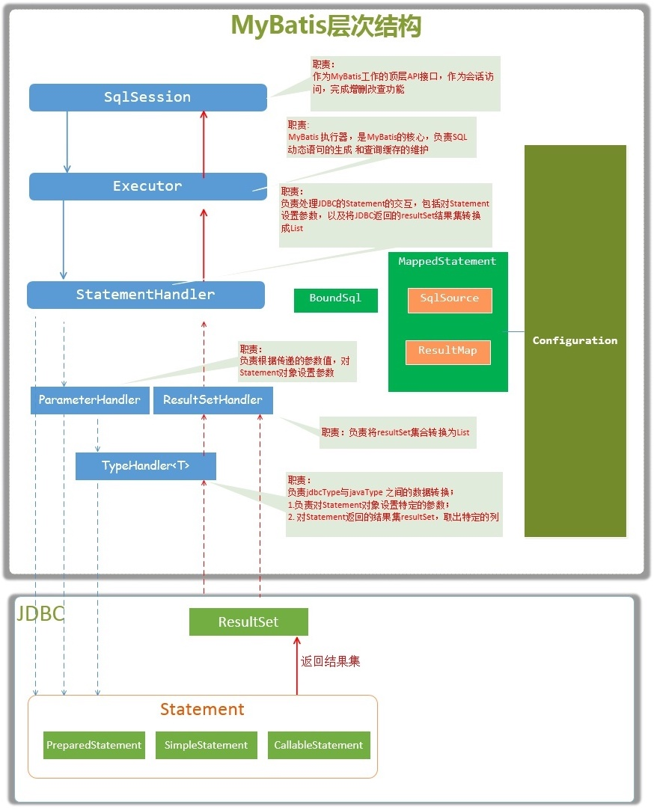
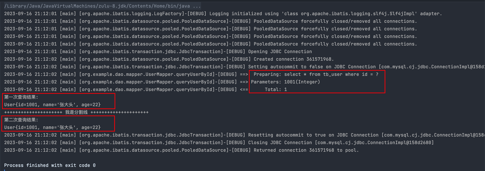
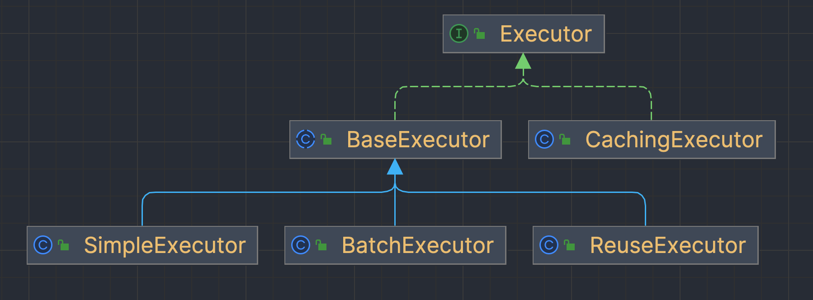
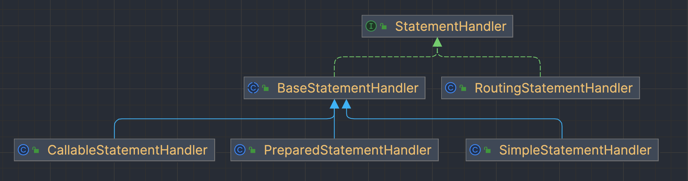
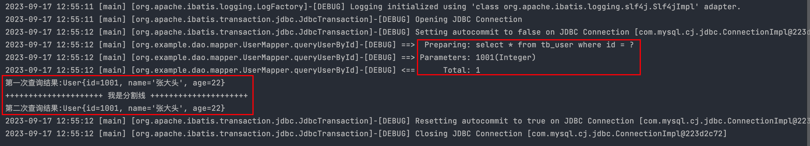
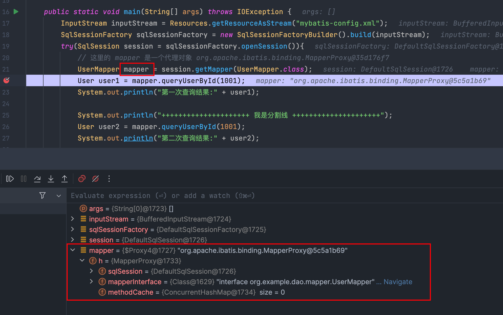
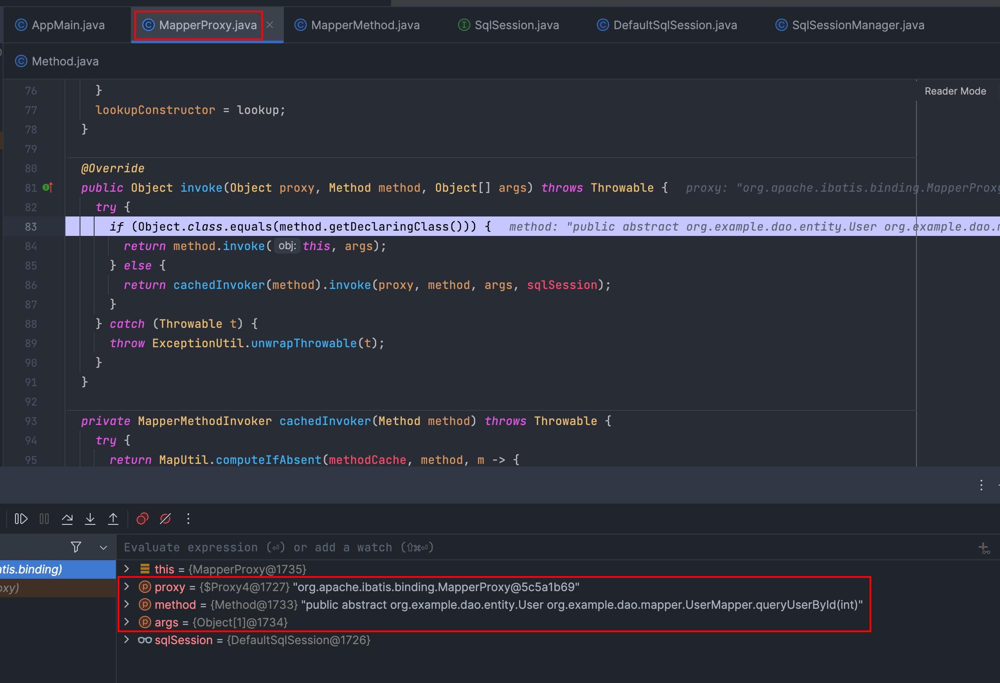
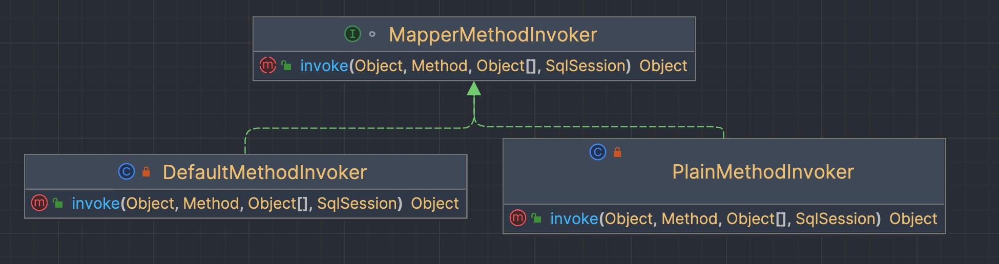

### 原生`Mybatis` 原理解析

[TOC]

#### 官网

[MyBatis](https://mybatis.org/mybatis-3/zh/index.html)  [源码仓库](https://github.com/mybatis/mybatis-3/tree/master)


#### 原生 `Mybatis` 使用步骤

参考 [Mybatis入门教程](https://mybatis.org/mybatis-3/zh/getting-started.html)

1. 读取配置文件 **mybatis-config.xml** 构建 **SqlSessionFactory**；

2. 通过 **SqlSessionFactory** 拿到 **SqlSession**；

3.  通过 **SqlSession** 和 **XML** 映射文件中sql的全限定名执行 **SQL**

    或者通过 **SqlSession** 拿到 **Mapper** 接口的动态代理对象，由动态代理对象执行 **SQL** 语句；

4. 关闭 **SqlSession**。


#### `MyBatis` 关键对象生命周期

使用 原生**MyBatis** 时，使用到了几个关键对象，分别是：**SqlSessionFactoryBuilder**，**SqlSessionFactory**，**SqlSession**和**Mapper**接口实例。下面给出这几个关键对象的生命周期。

| 对象                         | 生命周期   | 说明                                                         |
| ---------------------------- | ---------- | ------------------------------------------------------------ |
| **SqlSessionFactoryBuilder** | 方法局部   | 用于创建**SqlSessionFactory**，<br />当**SqlSessionFactory**创建完毕后，就不需要**SqlSessionFactoryBuilder**了 |
| **SqlSessionFactory**        | 应用级别   | 用于创建**SqlSession**，由于每次与数据库进行交互时，<br />需要先获取**SqlSession**，因此**SqlSessionFactory**应该是单例并且与应用生命周期保持一致 |
| **SqlSession**               | 请求或操作 | 用于访问数据库，访问前需要通过**SqlSessionFactory**创建本次访问所需的**SqlSession**，访问后需要销毁本次访问使用的**SqlSession**，<br />所以**SqlSession**的生命周期是一次请求的开始到结束 |
| **Mapper**接口实例           | 方法       | **Mapper**接口实例通过**SqlSession**获取，所以**Mapper**接口实例的生命周期最长可以与**SqlSession**相等，同时**Mapper**接口实例的最佳生命周期范围应该是方法范围，即在一个方法中通过**SqlSession**获取到**Mapper**接口实例并执行完逻辑后，该**Mapper**接口实例就应该被丢弃 |


#### `MyBatis` 关键组件 和 运行流程

* `org.apache.ibatis.session.Configuration`

> `MyBatis` 所有的配置信息都保存在 `Configuration` 对象之中，配置文件中的大部分配置都会存储到该类中

* `org.apache.ibatis.session.SqlSession`

> `MyBatis` 工作的主要顶层API，表示和数据库交互时的会话，完成必要数据库增删改查功能

* `org.apache.ibatis.executor.Executor`

> `MyBatis` 执行器，是 `MyBatis`  调度的核心，负责SQL语句的生成和查询缓存的维护

* `org.apache.ibatis.executor.statement.StatementHandler`

> 封装了`JDBC Statement`操作，负责对 `JDBC statement` 的操作，如设置参数等

* `org.apache.ibatis.executor.parameter.ParameterHandler`

> 负责对用户传递的参数转换成 `JDBC Statement` 所对应的数据类型

* `org.apache.ibatis.executor.resultset.ResultSetHandler`

> 负责将 `JDBC` 返回的 `ResultSet` 结果集对象转换成 `List` 类型的集合

* `org.apache.ibatis.type.TypeHandler`

> 负责 `java` 数据类型和 `jdbc` 数据类型（也可以说是数据表列类型）之间的映射和转换

* `org.apache.ibatis.mapping.MappedStatement`

> 维护 `xml` 中一条 `<select|update|delete|insert>` sql 节点的封装

* `org.apache.ibatis.mapping.SqlSource`

> 负责根据用户传递的`parameterObject`，动态地生成`SQL`语句，将信息封装到`BoundSql`对象中，并返回

* `org.apache.ibatis.mapping.BoundSql`

> 表示动态生成的 `SQL` 语句以及相应的参数信息




#### 原生 `Mybatis` 使用示例

##### 1. 创建数据库表

```sql
-- 创建用户表
CREATE TABLE user(
    id INT,
    name VARCHAR(10),
    age INT
);

-- 插入数据
INSERT INTO user(id, name, age)
VALUES(1001, '张大头', 22),(1002, '李大头', 23);

-- 查询记录
SELECT * FROM user;
```

##### 2. 新建 `User` 实体类

```java
public class User implements Serializable {
    private static final long serialVersionUID = 1648067819834901580L;

    private int id;
    private String name;
    private int age;
  
  	// 省略 get set
}
```

##### 3. 新建 `Mapper` 接口

```java
public interface UserMapper {
    
    /**
     * find user by id
     * 
     * @param id    userId
     * @return  {@link User}
     */
    User queryUserById(int id);

    /**
     * get all users
     * 
     * @return {@link List}
     */
    List<User> queryUserAll();

    /**
     * add user
     * 
     * @param user {@link User}
     */
    void insertUser(User user);

    /**
     * update user's information
     * 
     * @param user {@link User}
     */
    void updateUser(User user);

    /**
     *  delete a user by id
     *  
     * @param id userId
     */
    void deleteUserById(int id);
    
}
```

##### 4. 新建 `UserMapper`  接口对应的  `UserMapper.xml`

```xml
<?xml version="1.0" encoding="UTF-8" ?>
<!DOCTYPE mapper
        PUBLIC "-//mybatis.org//DTD Mapper 3.0//EN"
        "http://mybatis.org/dtd/mybatis-3-mapper.dtd">
<!-- mapper:根标签，namespace：命名空间，随便写，一般保证命名空间唯一 ，为了使用接口动态代理，这里必须是接口的全路径名-->
<mapper namespace="org.example.dao.mapper.UserMapper">
    <!--
       1.#{},预编译的方式 prepared statement，使用占位符替换，防止sql注入，一个参数的时候，任意参数名可以接收
       2.${},普通的Statement，字符串直接拼接，不可以防止sql注入，一个参数的时候，必须使用${value}接收参数
     -->
    <!-- statement，内容：sql语句。
       id：唯一标识，随便写，在同一个命名空间下保持唯一，使用动态代理之后要求和方法名保持一致
       resultType：sql语句查询结果集的封装类型，使用动态代理之后和方法的返回类型一致；resultMap：二选一
       parameterType：参数的类型，使用动态代理之后和方法的参数类型一致
     -->
    <!-- 开启二级缓存，当二级缓存开启后，同一个命名空间(namespace) 所有的操作语句，都影响着一个共同的 cache
         也就是二级缓存被多个 SqlSession 共享，是一个全局的变量。
         当开启缓存后，数据的查询执行的流程就是 二级缓存 -> 一级缓存 -> 数据库。
        <cache></cache>
    -->
  
    <select id="queryUserById" resultType="org.example.dao.entity.User">
        select * from user where id = #{id}
    </select>

    <select id="queryUserAll" resultType="org.example.dao.entity.User">
        select * from user
    </select>
    
    <!-- 新增的Statement
       id：唯一标识，随便写，在同一个命名空间下保持唯一，使用动态代理之后要求和方法名保持一致
       parameterType：参数的类型，使用动态代理之后和方法的参数类型一致
       useGeneratedKeys:开启主键回写
       keyColumn：指定数据库的主键
       keyProperty：主键对应的pojo属性名
     -->
    <insert id="insertUser" useGeneratedKeys="true" keyColumn="id" keyProperty="id"
            parameterType="org.example.dao.entity.User">
        INSERT INTO user (id, name, age)
        VALUES (#{id}, #{name},#{age},)
    </insert>

    <!--
       更新的statement
       id：唯一标识，随便写，在同一个命名空间下保持唯一，使用动态代理之后要求和方法名保持一致
       parameterType：参数的类型，使用动态代理之后和方法的参数类型一致
     -->
    <update id="updateUser" parameterType="org.example.dao.entity.User">
        UPDATE user
        <trim prefix="set" suffixOverrides=",">
            <if test="name!=null">name = #{name},</if>
            <if test="age!=null">age = #{age},</if>
        </trim>
        WHERE id = #{id}
    </update>

    <!--
       删除的statement
       id：唯一标识，随便写，在同一个命名空间下保持唯一，使用动态代理之后要求和方法名保持一致
       parameterType：参数的类型，使用动态代理之后和方法的参数类型一致
     -->
    <delete id="deleteUserById" parameterType="java.lang.String">
        delete from user where id=#{id}
    </delete>

</mapper>
```

##### 5. 新建 `Mybatis` 配置文件，`mybatis-config.xml`

```xml
<?xml version="1.0" encoding="UTF-8" ?>
<!DOCTYPE configuration
        PUBLIC "-//mybatis.org//DTD Config 3.0//EN"
        "http://mybatis.org/dtd/mybatis-3-config.dtd">
        
<configuration>
    <environments default="development">
        <environment id="development">
            <transactionManager type="JDBC"/>
            <dataSource type="POOLED">
                <property name="driver" value="com.mysql.cj.jdbc.Driver"/>
                <property name="url" value="jdbc:mysql://localhost:3306/test"/>
                <property name="username" value="root"/>
                <property name="password" value="root"/>
            </dataSource>
        </environment>
    </environments>
    
    <mappers>
      	<!--resource-->
        <mapper resource="mappers/UserMapper.xml" />
        
      	<!--class-->
				<!--<mapper class="org.example.dao.mapper.UserMapper"/>-->

        <!--url-->
				<!--<mapper url="/Users/super/PROJ/gitee/mybatis-demo-				master/src/main/java/org/example/dao/mapper/UserMapper.java"/>-->

        <!--package-->
  			<!--<package name="org.example.dao.mapper" />-->
    </mappers>
</configuration>
```

##### 6. 测试类

```java
public class AppMain {
    public static void main(String[] args) throws IOException {
        InputStream inputStream = Resources.getResourceAsStream("mybatis-config.xml");
        SqlSessionFactory sqlSessionFactory = new SqlSessionFactoryBuilder().build(inputStream);

        try(SqlSession session = sqlSessionFactory.openSession()){
            User user1 = session.selectOne("org.example.dao.mapper.UserMapper.queryUserById", 1001);
            System.out.println("第一次查询结果:");
            System.out.println(user1);

            System.out.println("+++++++++++++++++++++ 我是分割线 +++++++++++++++++++++");
            User user2 = session.selectOne("org.example.dao.mapper.UserMapper.queryUserById", 1001);
            System.out.println("第二次查询结果:");  
            System.out.println(user2);
        }catch (Exception e){
            e.printStackTrace();
        }
    }
}
```


#### `Mybatis` 初始化源码解析

```java
InputStream inputStream = Resources.getResourceAsStream("mybatis-config.xml");
SqlSessionFactory sqlSessionFactory = new SqlSessionFactoryBuilder().build(inputStream);
```

上面代码的意思就是根据主配置文件的流对象构建一个 **会话工厂(SqlSessionFactory)** 对象，而且还用到了 **建造者模式**（大致意思就是要创建某个对象不直接 `new` 这个对象而是利用其它的类来创建这个对象）。`mybatis` 的所有初始化工作都是这行代码完成，那么我们进去一探究竟。

##### step1  进入 `build` 方法

> `org.apache.ibatis.session.SqlSessionFactoryBuilder#build(java.io.InputStream)`

```java
public SqlSessionFactory build(InputStream inputStream) {
  return build(inputStream, null, null);
}

public SqlSessionFactory build(InputStream inputStream, String environment, Properties properties) {
  try {
    XMLConfigBuilder parser = new XMLConfigBuilder(inputStream, environment, properties);
    return build(parser.parse());
  } catch (Exception e) {
    throw ExceptionFactory.wrapException("Error building SqlSession.", e);
  } finally {
    ErrorContext.instance().reset();
    try {
      inputStream.close();
    } catch (IOException e) {
      // Intentionally ignore. Prefer previous error.
    }
  }
}
```

可以看到会创建一个 `XMLConfigBuilder` 对象，这个对象的作用就是解析主配置文件用的。先说明一下，我们可以看出主配置文件的最外层节点是 <configuration> 标签，`mybatis` 的初始化就是把这个标签以及他的所有子标签进行解析，把解析好的数据封装在 `Configuration` 这个类中。


##### step2 进入 `parse` 方法

> `org.apache.ibatis.builder.xml.XMLConfigBuilder#parse`

```java
public Configuration parse() {
  if (parsed) {
    throw new BuilderException("Each XMLConfigBuilder can only be used once.");
  }
  parsed = true;
  parseConfiguration(parser.evalNode("/configuration"));
  return configuration;
}
```

`XMLConfigBuilder` 维护一个`parsed` 属性默认为`false`，这个方法一开始就判断这个主配置文件是否已经被解析，如果解析过了就抛异常。

##### step3 进入`parseConfiguration` 方法

> `org.apache.ibatis.builder.xml.XMLConfigBuilder#parseConfiguration`

```java
private void parseConfiguration(XNode root) {
  try {
    // issue #117 read properties first
    propertiesElement(root.evalNode("properties"));
    Properties settings = settingsAsProperties(root.evalNode("settings"));
    loadCustomVfs(settings);
    loadCustomLogImpl(settings);
    typeAliasesElement(root.evalNode("typeAliases"));
    pluginElement(root.evalNode("plugins"));
    objectFactoryElement(root.evalNode("objectFactory"));
    objectWrapperFactoryElement(root.evalNode("objectWrapperFactory"));
    reflectorFactoryElement(root.evalNode("reflectorFactory"));
    settingsElement(settings);
    // read it after objectFactory and objectWrapperFactory issue #631
    environmentsElement(root.evalNode("environments"));
    databaseIdProviderElement(root.evalNode("databaseIdProvider"));
    typeHandlerElement(root.evalNode("typeHandlers"));
    mapperElement(root.evalNode("mappers"));
  } catch (Exception e) {
    throw new BuilderException("Error parsing SQL Mapper Configuration. Cause: " + e, e);
  }
}
```

我们可以看出这个方法是对 <configuration> 的所有子标签挨个解析。比如常在配置文件中出现的 <setting> 属性配置，在<settings> 会配置缓存，日志之类的。还有 <typeAliases> 是配置别名。<environments> 是配置数据库链接和事务。这些子节点会被一个个解析并且把解析后的数据封装在 `Configuration` 这个类中，可以看 [step2方法](#step2 进入-parse-方法) 的返回值就是 `Configuration` 对象。在这里我们重点分析的解析 <mappers> 这个子标签，这个标签里面还会有一个个的 <mapper> 标签去映射 `mapper` 所对应的`mapper.xml`，可以回头看看主配置文件。


##### step4 进入 `mapperElement` 方法

> `org.apache.ibatis.builder.xml.XMLConfigBuilder#mapperElement`

```java
private void mapperElement(XNode parent) throws Exception {
  if (parent != null) {
    for (XNode child : parent.getChildren()) {
      if ("package".equals(child.getName())) {
        String mapperPackage = child.getStringAttribute("name");
        configuration.addMappers(mapperPackage);
      } else {
        String resource = child.getStringAttribute("resource");
        String url = child.getStringAttribute("url");
        String mapperClass = child.getStringAttribute("class");
        if (resource != null && url == null && mapperClass == null) {
          ErrorContext.instance().resource(resource);
          try(InputStream inputStream = Resources.getResourceAsStream(resource)) {
            XMLMapperBuilder mapperParser = new XMLMapperBuilder(inputStream, configuration, resource, configuration.getSqlFragments());
            mapperParser.parse();
          }
        } else if (resource == null && url != null && mapperClass == null) {
          ErrorContext.instance().resource(url);
          try(InputStream inputStream = Resources.getUrlAsStream(url)){
            XMLMapperBuilder mapperParser = new XMLMapperBuilder(inputStream, configuration, url, configuration.getSqlFragments());
            mapperParser.parse();
          }
        } else if (resource == null && url == null && mapperClass != null) {
          Class<?> mapperInterface = Resources.classForName(mapperClass);
          configuration.addMapper(mapperInterface);
        } else {
          throw new BuilderException("A mapper element may only specify a url, resource or class, but not more than one.");
        }
      }
    }
  }
}
```

（1）这个方法一开始是一个循环，为什么要循环呢？因为一个 <mappers> 节点下面可能会有很多 <mapper> 节点。在应用中肯定不止一个`mapper.xml`。所以他会去遍历每一个 <mapper> 节点去解析该节点所映射的 `xm`l文件。

（2）循环下面是一个 `if..else` 判断。它先判断 <mappers> 下面的子节点是不是 <package> 节点。因为在实际开发中有很多的`xml` 文件，不可能每一个 `xml` 文件都用一个 <mapper> 节点去映射，我们干脆会用一个 <package> 节点去映射一个包下面的所有的`xml`，这是多文件映射。

（3）如果不是 <package> 节点那肯定就是 <mapper> 节点做单文件映射。我们看下面的三行代码，发现单文件映射有3种方式： 第一种使用 <mapper> 节点的 `resource` 属性直接映射 `xml`文件。 第二种是使用 <mapper> 节点 `url` 属性映射磁盘内的某个`xml` 文件。第三种是使用 <mapper> 节点的 `class` 属性直接映射某个 `mapper` 接口。可以回头看看我的主配置文件的 <mappers> 节点。

（4）实际上映射 `xml` 的方式看源码可以得出有4种方式，我们先看单文件映射的 `resource` 方式，因为这种方式理解了其他三种方式就比较好理解了。


##### step5 看 `resource` 方式解析 `xml`

```java
if (resource != null && url == null && mapperClass == null) {
  ErrorContext.instance().resource(resource);
  try(InputStream inputStream = Resources.getResourceAsStream(resource)) {
    XMLMapperBuilder mapperParser = new XMLMapperBuilder(inputStream, configuration, resource, configuration.getSqlFragments());
    mapperParser.parse();
  }
} 
```

（1）第一行代码的意思是实例化一个错误上下文对象。这个对象是干什么用的呢？我们回忆一下我们使用 `mybatis` 的过程中如果出现错误会不会提示这个错误在哪个 `xml` 中，还提示这个错误在 `xml` 中的哪个 `sql` 中。这个对象`ErrorContext`的作用就是 **把错误信息封装起来**，如果出现错误就会调用这个对象的 `toString` 方法，感兴趣的可以去看看这个对象的源码。这个 `resource` 参数就是 `String` 类型的 `xml` 的名字，在我们的项目中是 `UserMapper.xml`。

（2）第二行没什么好说的就是读取这个xml获取输入流对象。

（3）然后创建一个`mapper` 的 `xml` 文件解析器，你看他们这名字起的，一看就知道是什么意思。就好比那个 `XMLConfigBuilder` 一看就是解析主配置文件用的。


##### step6 进入 `parse` 方法

> `org.apache.ibatis.builder.xml.XMLMapperBuilder#parse`

```java
public void parse() {
  if (!configuration.isResourceLoaded(resource)) {
    configurationElement(parser.evalNode("/mapper"));
    configuration.addLoadedResource(resource);
    bindMapperForNamespace();
  }

  parsePendingResultMaps();
  parsePendingCacheRefs();
  parsePendingStatements();
}
```

一开始就会先判断这个 `xml` 是否被解析过了。因为 `configuration` 对象会维护一个`String` 类型的 `set` 集合 `loadedResources`，这个集合中存放了所有已经被解析过的 `xml` 的名字，我们在这里是没有被解析的，所以进入`if`中。


##### step7 进入 `configurationElement` 方法

> `org.apache.ibatis.builder.xml.XMLMapperBuilder#configurationElement`

```java
private void configurationElement(XNode context) {
  try {
    String namespace = context.getStringAttribute("namespace");
    if (namespace == null || namespace.isEmpty()) {
      throw new BuilderException("Mapper's namespace cannot be empty");
    }
    builderAssistant.setCurrentNamespace(namespace);
    cacheRefElement(context.evalNode("cache-ref"));
    cacheElement(context.evalNode("cache"));
    parameterMapElement(context.evalNodes("/mapper/parameterMap"));
    resultMapElements(context.evalNodes("/mapper/resultMap"));
    sqlElement(context.evalNodes("/mapper/sql"));
    buildStatementFromContext(context.evalNodes("select|insert|update|delete"));
  } catch (Exception e) {
    throw new BuilderException("Error parsing Mapper XML. The XML location is '" + resource + "'. Cause: " + e, e);
  }
}
```

这个方法就是解析一个 `mapper.xml` 所有节点数据。比如解析 `namespace`，`resultMap`等等。重点是最后一句：

```java
buildStatementFromContext(context.evalNodes("select|insert|update|delete"));
```

我们进入这个方法中 `buildStatementFromContext`

```java
private void buildStatementFromContext(List<XNode> list) {
  if (configuration.getDatabaseId() != null) {
    buildStatementFromContext(list, configuration.getDatabaseId());
  }
  buildStatementFromContext(list, null);
}
```

没什么好说的，继续进入 `buildStatementFromContext`

```java
private void buildStatementFromContext(List<XNode> list, String requiredDatabaseId) {
  for (XNode context : list) {
    final XMLStatementBuilder statementParser = new XMLStatementBuilder(configuration, builderAssistant, context, requiredDatabaseId);
    try {
      statementParser.parseStatementNode();
    } catch (IncompleteElementException e) {
      configuration.addIncompleteStatement(statementParser);
    }
  }
}
```

（1）这个方法一开始是一个循环，遍历一个 `list`，这个 `list` 里装的是 `xml` 中的所有 `sql` 节点，比如 <select insert update delete> ，每一个 `sql` 是一个节点。循环解析每一个sql节点。

（2）创建一个xml的会话解析器去解析每个节点。


##### step8 进入 `parseStatementNode` 方法

> `org.apache.ibatis.builder.xml.XMLStatementBuilder#parseStatementNode`

```java
public void parseStatementNode() {
  String id = context.getStringAttribute("id");
  String databaseId = context.getStringAttribute("databaseId");

  if (!databaseIdMatchesCurrent(id, databaseId, this.requiredDatabaseId)) {
    return;
  }

  String nodeName = context.getNode().getNodeName();
  SqlCommandType sqlCommandType = SqlCommandType.valueOf(nodeName.toUpperCase(Locale.ENGLISH));
  boolean isSelect = sqlCommandType == SqlCommandType.SELECT;
  boolean flushCache = context.getBooleanAttribute("flushCache", !isSelect);
  boolean useCache = context.getBooleanAttribute("useCache", isSelect);
  boolean resultOrdered = context.getBooleanAttribute("resultOrdered", false);

  // Include Fragments before parsing
  XMLIncludeTransformer includeParser = new XMLIncludeTransformer(configuration, builderAssistant);
  includeParser.applyIncludes(context.getNode());

  String parameterType = context.getStringAttribute("parameterType");
  Class<?> parameterTypeClass = resolveClass(parameterType);

  String lang = context.getStringAttribute("lang");
  LanguageDriver langDriver = getLanguageDriver(lang);

  // Parse selectKey after includes and remove them.
  processSelectKeyNodes(id, parameterTypeClass, langDriver);

  // Parse the SQL (pre: <selectKey> and <include> were parsed and removed)
  KeyGenerator keyGenerator;
  String keyStatementId = id + SelectKeyGenerator.SELECT_KEY_SUFFIX;
  keyStatementId = builderAssistant.applyCurrentNamespace(keyStatementId, true);
  if (configuration.hasKeyGenerator(keyStatementId)) {
    keyGenerator = configuration.getKeyGenerator(keyStatementId);
  } else {
    keyGenerator = context.getBooleanAttribute("useGeneratedKeys",
        configuration.isUseGeneratedKeys() && SqlCommandType.INSERT.equals(sqlCommandType))
        ? Jdbc3KeyGenerator.INSTANCE : NoKeyGenerator.INSTANCE;
  }

  SqlSource sqlSource = langDriver.createSqlSource(configuration, context, parameterTypeClass);
  StatementType statementType = StatementType.valueOf(context.getStringAttribute("statementType", StatementType.PREPARED.toString()));
  Integer fetchSize = context.getIntAttribute("fetchSize");
  Integer timeout = context.getIntAttribute("timeout");
  String parameterMap = context.getStringAttribute("parameterMap");
  String resultType = context.getStringAttribute("resultType");
  Class<?> resultTypeClass = resolveClass(resultType);
  String resultMap = context.getStringAttribute("resultMap");
  String resultSetType = context.getStringAttribute("resultSetType");
  ResultSetType resultSetTypeEnum = resolveResultSetType(resultSetType);
  if (resultSetTypeEnum == null) {
    resultSetTypeEnum = configuration.getDefaultResultSetType();
  }
  String keyProperty = context.getStringAttribute("keyProperty");
  String keyColumn = context.getStringAttribute("keyColumn");
  String resultSets = context.getStringAttribute("resultSets");

  builderAssistant.addMappedStatement(id, sqlSource, statementType, sqlCommandType,
      fetchSize, timeout, parameterMap, parameterTypeClass, resultMap, resultTypeClass,
      resultSetTypeEnum, flushCache, useCache, resultOrdered,
      keyGenerator, keyProperty, keyColumn, databaseId, langDriver, resultSets);
}
```

看到这个方法很长，其实大致意思就是解析这个 `sql` 标签里的所有数据，并把所有数据通过 `addMappedStatement` 这个方法封装在`MappedStatement` 这个对象中。这个对象我们在 [`MyBatis`  关键组件 和 运行流程](#`MyBatis`-关键组件-和-运行流程) 中介绍过，这个对象中封装了一条 `sql` 所在标签的所有内容，比如这个`sql` 标签的 `id` ，`sql`语句，入参，出参，等等。我们要牢记一个 `sql` 的标签对应一个 `MappedStatement` 对象。


##### step9 进入 `addMapperStatement` 方法

> `org.apache.ibatis.builder.MapperBuilderAssistant#addMappedStatement(java.lang.String, org.apache.ibatis.mapping.SqlSource, org.apache.ibatis.mapping.StatementType, org.apache.ibatis.mapping.SqlCommandType, java.lang.Integer, java.lang.Integer, java.lang.String, java.lang.Class<?>, java.lang.String, java.lang.Class<?>, org.apache.ibatis.mapping.ResultSetType, boolean, boolean, boolean, org.apache.ibatis.executor.keygen.KeyGenerator, java.lang.String, java.lang.String, java.lang.String, org.apache.ibatis.scripting.LanguageDriver, java.lang.String)`

```java
public MappedStatement addMappedStatement(
    String id,
    SqlSource sqlSource,
    StatementType statementType,
    SqlCommandType sqlCommandType,
    Integer fetchSize,
    Integer timeout,
    String parameterMap,
    Class<?> parameterType,
    String resultMap,
    Class<?> resultType,
    ResultSetType resultSetType,
    boolean flushCache,
    boolean useCache,
    boolean resultOrdered,
    KeyGenerator keyGenerator,
    String keyProperty,
    String keyColumn,
    String databaseId,
    LanguageDriver lang,
    String resultSets) {

  if (unresolvedCacheRef) {
    throw new IncompleteElementException("Cache-ref not yet resolved");
  }

  id = applyCurrentNamespace(id, false);
  boolean isSelect = sqlCommandType == SqlCommandType.SELECT;

  MappedStatement.Builder statementBuilder = new MappedStatement.Builder(configuration, id, sqlSource, sqlCommandType)
      .resource(resource)
      .fetchSize(fetchSize)
      .timeout(timeout)
      .statementType(statementType)
      .keyGenerator(keyGenerator)
      .keyProperty(keyProperty)
      .keyColumn(keyColumn)
      .databaseId(databaseId)
      .lang(lang)
      .resultOrdered(resultOrdered)
      .resultSets(resultSets)
      .resultMaps(getStatementResultMaps(resultMap, resultType, id))
      .resultSetType(resultSetType)
      .flushCacheRequired(valueOrDefault(flushCache, !isSelect))
      .useCache(valueOrDefault(useCache, isSelect))
      .cache(currentCache);

  ParameterMap statementParameterMap = getStatementParameterMap(parameterMap, parameterType, id);
  if (statementParameterMap != null) {
    statementBuilder.parameterMap(statementParameterMap);
  }

  MappedStatement statement = statementBuilder.build();
  configuration.addMappedStatement(statement);
  return statement;
}
```

乍一看这个方法很长，我们只看最后三行代码。

（1） `MappedStatement statement = statementBuilder.build();` 通过解析出的参数构建了一个 `MapperStatement` 对象。

（2）`configuration.addMappedStatement(statement);` 这行是把解析出来的 `MapperStatement` 装到 `Configuration` 维护的`Map` 集合中。`key` 值是这个 `sql` 标签的 `id` 值，我们这里应该就是 `queryUserById`, `value`值就是我们解析出来的`MapperStatement` 对象。

其实我们解析 `xml` 的目的就是把每个`xml` 中的每个增删改查的 `sql` 标签解析成一个个 `MapperStatement` 并把解析出来的这些对象装到 `Configuration` 的 `Map` 中备用。


##### step10 返回 [setp6](#step6 进入-`parse`-方法) 的代码

```java
public void parse() {
  if (!configuration.isResourceLoaded(resource)) {
    configurationElement(parser.evalNode("/mapper"));
    configuration.addLoadedResource(resource);
    bindMapperForNamespace();
  }

  parsePendingResultMaps();
  parsePendingCacheRefs();
  parsePendingStatements();
}
```

从 [step7](#step7 进入-`configurationElement`-方法) 到 [step9](#step9 进入-`addMapperStatement`-方法) 都是在执行 `configurationElement(parser.evalNode("/mapper"));` 这行代码，接下来看下一行代码`configuration.addLoadedResource(resource);`。 到 [step9](#step9 进入-`addMapperStatement`-方法)  时，我们已经把一个个`xml` 完全解析完了，所以在此就会把这个解析完的 `xml` 的名字装到 `set` 集合中。

接下来我们看看 `bindMapperForNamespace();`， 这个名字起得就很望文生义，通过命名空间绑定 `mapper`。


##### step11 进入 `bindMapperForNamespace` 方法

> `org.apache.ibatis.builder.xml.XMLMapperBuilder#bindMapperForNamespace`

```java
private void bindMapperForNamespace() {
  String namespace = builderAssistant.getCurrentNamespace();
  if (namespace != null) {
    Class<?> boundType = null;
    try {
      boundType = Resources.classForName(namespace);
    } catch (ClassNotFoundException e) {
      // ignore, bound type is not required
    }
    if (boundType != null && !configuration.hasMapper(boundType)) {
      // Spring may not know the real resource name so we set a flag
      // to prevent loading again this resource from the mapper interface
      // look at MapperAnnotationBuilder#loadXmlResource
      configuration.addLoadedResource("namespace:" + namespace);
      configuration.addMapper(boundType);
    }
  }
}
```

（1）一开始获取命名空间 `namespace`，命名空间一般都是我们 `mapper` 的全限定名，它通过反射获取这个 `mapper` 的 `class` 对象。

（2）`if` 判断，`Configuration` 中也维护了一个 `Map` 对象，`key` 值是我们刚才通过反射生产的 `mapper` 的 `class` 对象，`value` 值是通过 **动态代理** 生产的 `class` 对象的代理对象。

（3）因为 `Map` 中还没有装我们生产的 `mapper` 对象，进入 `if` 中，它先把命名空间 `namespace` 存到我们刚才存 `xml` 名字的 `set` 集合中。然后再把生产的 `mapper` 的 `class` 对象存到 `Mapper` 中。


##### step12 进入 `ddMapper` 方法

> `org.apache.ibatis.session.Configuration#addMapper`

```java
public <T> void addMapper(Class<T> type) {
  mapperRegistry.addMapper(type);
}
```

我们发现它调用了 `mapperRegistry` 的 `addMapper` 方法，这个类通过名字就知道是 `mapper` 注册类，我们再点进入看看：

> `org.apache.ibatis.binding.MapperRegistry#addMapper`

```java
public <T> void addMapper(Class<T> type) {
  if (type.isInterface()) {
    if (hasMapper(type)) {
      throw new BindingException("Type " + type + " is already known to the MapperRegistry.");
    }
    boolean loadCompleted = false;
    try {
      knownMappers.put(type, new MapperProxyFactory<>(type));
      // It's important that the type is added before the parser is run
      // otherwise the binding may automatically be attempted by the
      // mapper parser. If the type is already known, it won't try.
      MapperAnnotationBuilder parser = new MapperAnnotationBuilder(config, type);
      parser.parse();
      loadCompleted = true;
    } finally {
      if (!loadCompleted) {
        knownMappers.remove(type);
      }
    }
  }
}
```

我们可以看出 `mapperRegistry` 这个类维护了一个名为 `knownMappers` 的 `Map` (已知的`mapper` --> 即已注册过的`mapper`)。我们看他的 `put`，`key` 是我们生成的 `mapper` 的 `class` 对象，`value` 是用来生成动态代理对象的工厂类。

> 关于 **动态代理** 的介绍，参考文章 [`JDK` 动态代理 `Proxy` 和 `InvocationHandler`](JDK动态代理InvocationHandler和Proxy.md)

到此 `mybatis` 根据主配置文件初始化就完成了，总结一下过程：

> * 总的来说就是解析主配置文件把主配置文件里的所有信息封装到 `Configuration` 这个对象中。
> *  稍微细一点就是：通过 `XmlConfigBuilder` 解析主配置文件，然后通过 `XmlMapperBuild` 解析 <mappers>下映射的所有`xml`文件（循环解析）。把每个 `xml` 中的各个 `sql` 解析成一个个 `MapperStatement` 对象装在 `Configuration` 维护的一个 `Map` 集合中，`key`值是 `id`，`value` 是 `mapperstatement`对象，然后把解析过的 `xml` 的名字和命名空间装在 `set` 集合中，通过命名空间反射生成的 `mapper` 的 `class` 对象以及生成 `class` 代理对象的工厂类对象装在 `Configuration` 对象维护的`mapperRegistry` 中的 `Map` 中。
> * 简化一点：主要就是把每个 `sql` 标签解析成 `mapperstatement` 对象装进集合，然后把 `mapper` 接口的 `class` 对象以及代理对象装进集合，方便以后使用。
> * 注意一点： 我们用 `resource` 引入 `xml` 的方法是先解析 `xml` ，把各个 `sql` 标签解析成 `mapperstatement` 对象装进集合，然后再把 `mapper` 接口的 `class` 对象以及代理对象装进集合，但是引入 `xml` 的方式有4种，其中单文件引入方式还有`url` 方式和 `class` 方式，看源码可以知道 `url` 方式就是直接引入一个 `xml` 和 `resource` 方式一模一样。而 `class` 方式是引入一个 `mapper` 接口。


##### step13 使用 `class` 方式加载 `mapper` 的方法

我们看一下使用class方式引入的方法

```java
else if (resource == null && url == null && mapperClass != null) {
  Class<?> mapperInterface = Resources.classForName(mapperClass);
  configuration.addMapper(mapperInterface);
} 
```

我们可以看出是不是先反射生产 `mapper` 接口的 `class` 对象，然后调用 `Configuration` 的 `addMpper` 方法，这个方法是不是很熟悉，我们点进去看一下：

```java
public <T> void addMapper(Class<T> type) {
  mapperRegistry.addMapper(type);
}

public <T> void addMapper(Class<T> type) {
  if (type.isInterface()) {
    if (hasMapper(type)) {
      throw new BindingException("Type " + type + " is already known to the MapperRegistry.");
    }
    boolean loadCompleted = false;
    try {
      knownMappers.put(type, new MapperProxyFactory<>(type));
      // It's important that the type is added before the parser is run
      // otherwise the binding may automatically be attempted by the
      // mapper parser. If the type is already known, it won't try.
      MapperAnnotationBuilder parser = new MapperAnnotationBuilder(config, type);
      parser.parse();
      loadCompleted = true;
    } finally {
      if (!loadCompleted) {
        knownMappers.remove(type);
      }
    }
  }
}
```

是不是跟上面 [step12](#step12 进入-`ddMapper`-方法) 一样，获取 `mapper` 的 `class` 对象后，再通过动态代理生产 **代理对象** 然后装进集合。那我们接口对象生成了不还没解析 `xml` 吗，别急我们进入 `parser.parse()` 这个方法

```java
public void parse() {
  String resource = type.toString();
  if (!configuration.isResourceLoaded(resource)) {
    loadXmlResource();
    configuration.addLoadedResource(resource);
    assistant.setCurrentNamespace(type.getName());
    parseCache();
    parseCacheRef();
    for (Method method : type.getMethods()) {
      if (!canHaveStatement(method)) {
        continue;
      }
      if (getAnnotationWrapper(method, false, Select.class, SelectProvider.class).isPresent()
          && method.getAnnotation(ResultMap.class) == null) {
        parseResultMap(method);
      }
      try {
        parseStatement(method);
      } catch (IncompleteElementException e) {
        configuration.addIncompleteMethod(new MethodResolver(this, method));
      }
    }
  }
  parsePendingMethods();
}
```

它会先判断这个 `mapper` 对应的 `xml` 是否在装载已解析过的 `xml` 的 `set`集合中，如果没有，则进入`if` ， 重点来了`loadXmlResource(); ` ，这个方法看名字就知道是加载xml资源，我们点进去看一下

> `org.apache.ibatis.builder.annotation.MapperAnnotationBuilder#loadXmlResource`

```java
private void loadXmlResource() {
  // Spring may not know the real resource name so we check a flag
  // to prevent loading again a resource twice
  // this flag is set at XMLMapperBuilder#bindMapperForNamespace
  if (!configuration.isResourceLoaded("namespace:" + type.getName())) {
    String xmlResource = type.getName().replace('.', '/') + ".xml";
    // #1347
    InputStream inputStream = type.getResourceAsStream("/" + xmlResource);
    if (inputStream == null) {
      // Search XML mapper that is not in the module but in the classpath.
      try {
        inputStream = Resources.getResourceAsStream(type.getClassLoader(), xmlResource);
      } catch (IOException e2) {
        // ignore, resource is not required
      }
    }
    if (inputStream != null) {
      XMLMapperBuilder xmlParser = new XMLMapperBuilder(inputStream, assistant.getConfiguration(), xmlResource, configuration.getSqlFragments(), type.getName());
      xmlParser.parse();
    }
  }
}
```

继续往下走，走到 `xmlParser.parse();`，这行代码中我们点进去看一下：

> `org.apache.ibatis.builder.xml.XMLMapperBuilder#parse`

```java
public void parse() {
  if (!configuration.isResourceLoaded(resource)) {
    configurationElement(parser.evalNode("/mapper"));
    configuration.addLoadedResource(resource);
    bindMapperForNamespace();
  }

  parsePendingResultMaps();
  parsePendingCacheRefs();
  parsePendingStatements();
}
```

这个方法是不是很眼熟？没错，这就是在 [step6](#step6 进入 `parse` 方法) 中分析的源码。接下来，就是熟悉的上面 [step6](#step6 进入 `parse` 方法)  到 [step9](#step9 进入 `addMapperStatement` 方法)。

> 可以看出用 `resource`、`url` 和 `class` 来解析的方式步骤是相反的。
>
> `resource` 和 `url` 是直接引入 `xml` ，先解析 `xml`，然后通过 `xml` 的 `namespace` 反射生成 `mapper` 的 `class`对象，再通过动态代理生产`class`对象的代理对象。
>
> `class` 方式传入的是 `mapper` 接口的全限定名，就是上面的那个 `namespace`，所以先生成 `class` 对象和代理对象，然后通过拼接字符串就是 `全限定名+.xml` 获取 `xml` 的名称，再解析`xml`。

说到这单文件映射就说完了，我们再说说多文件映射。


##### step14 多文件映射

> `org.apache.ibatis.builder.xml.XMLConfigBuilder#mapperElement`

```java
if ("package".equals(child.getName())) {
  String mapperPackage = child.getStringAttribute("name");
  configuration.addMappers(mapperPackage);
}
```

首先获得 `xml` 所在的包名，然后调用 `configuration` 的 `addMappers` 对象，是不是有点眼熟，单文件映射是 `addMapper`，多文件映射是 `addMappers` 。点进去看看

> `org.apache.ibatis.session.Configuration#addMappers(java.lang.String)`

```java
public void addMappers(String packageName) {
  mapperRegistry.addMappers(packageName);
}

public void addMappers(String packageName) {
  addMappers(packageName, Object.class);
}

public void addMappers(String packageName, Class<?> superType) {
  ResolverUtil<Class<?>> resolverUtil = new ResolverUtil<>();
  resolverUtil.find(new ResolverUtil.IsA(superType), packageName);
  Set<Class<? extends Class<?>>> mapperSet = resolverUtil.getClasses();
  for (Class<?> mapperClass : mapperSet) {
    addMapper(mapperClass);
  }
}
```

分析第三段代码，就是通过 `ResolverUtil` 这个解析工具类找出该包下的所有 `mappe` r的名称通过反射生产 `mapper` 的 `class` 对象装进集合中，然后看出循环调用 `addMapper(mapperClass)` 这个方法，这就和单文件映射的 `class` 类型一样了，把 `mapper` 接口的`class` 对象作为参数传进去，然后生产代理对象装进集合然后再解析 `xml`。

到此 `mybatis` 的初始化就说完了。


#### 获取 `session` 对象源码分析

回到 [初始化Mybatis](#`Mybatis` 初始化源码解析) 的  [step1](# step1  进入 `build` 方法) 中 `build` 操作

> `org.apache.ibatis.session.SqlSessionFactoryBuilder#build(java.io.InputStream, java.lang.String, java.util.Properties)`

```java
public SqlSessionFactory build(InputStream inputStream, String environment, Properties properties) {
  try {
    XMLConfigBuilder parser = new XMLConfigBuilder(inputStream, environment, properties);
    return build(parser.parse());
  } catch (Exception e) {
    throw ExceptionFactory.wrapException("Error building SqlSession.", e);
  } finally {
    ErrorContext.instance().reset();
    try {
      inputStream.close();
    } catch (IOException e) {
      // Intentionally ignore. Prefer previous error.
    }
  }
}
```

上一部分的 `mybatis` 的初始化，走的代码是：

```java
XMLConfigBuilder parser = new XMLConfigBuilder(inputStream, environment, properties);
parser.parse();
```

下面，我们点进 `build(parser.parse())` 的 `build` 方法中，会发现最后返回的是 `DefaultSqlSessionFactory` 对象：

```java
public SqlSessionFactory build(Configuration config) {
  return new DefaultSqlSessionFactory(config);
}
```

##### step1 `openSession`

再回到 [示例](#原生 `Mybatis` 使用示例) 中 [测试类](#6. 测试类) 获取 `session` 对象的代码是：

```java
try(SqlSession session = sqlSessionFactory.openSession())
```

直接 `open` 一个 `session`，我们知道 `session` 是我们与数据库互动的顶级 `api`，所有的增删改查都要调用 `session`。我们进入`openSession()`：

> `org.apache.ibatis.session.SqlSessionFactory`

```java
public interface SqlSessionFactory {

  SqlSession openSession();

  SqlSession openSession(boolean autoCommit);

  SqlSession openSession(Connection connection);

  SqlSession openSession(TransactionIsolationLevel level);

  SqlSession openSession(ExecutorType execType);

  SqlSession openSession(ExecutorType execType, boolean autoCommit);

  SqlSession openSession(ExecutorType execType, TransactionIsolationLevel level);

  SqlSession openSession(ExecutorType execType, Connection connection);

  Configuration getConfiguration();

}
```

我们发现这是一个接口，找他的实现类 `DefaultSqlSessionFactory`，截取 `openSession()` 方法的实现：

> `org.apache.ibatis.session.defaults.DefaultSqlSessionFactory`

```java
public class DefaultSqlSessionFactory implements SqlSessionFactory {
  
  @Override
  public SqlSession openSession() {
    return openSessionFromDataSource(configuration.getDefaultExecutorType(), null, false);
  }
  
  private SqlSession openSessionFromDataSource(ExecutorType execType, TransactionIsolationLevel level, boolean autoCommit) {
    Transaction tx = null;
    try {
      final Environment environment = configuration.getEnvironment();
      final TransactionFactory transactionFactory = getTransactionFactoryFromEnvironment(environment);
      tx = transactionFactory.newTransaction(environment.getDataSource(), level, autoCommit);
      final Executor executor = configuration.newExecutor(tx, execType);
      return new DefaultSqlSession(configuration, executor, autoCommit);
    } catch (Exception e) {
      closeTransaction(tx); // may have fetched a connection so lets call close()
      throw ExceptionFactory.wrapException("Error opening session.  Cause: " + e, e);
    } finally {
      ErrorContext.instance().reset();
    }
  }
  
}
```

分析 `openSessionFromDataSource` 方法：因为我们解析主配置文件把所有的节点信息都保存在了 `configuration` 对象中，它可以直接获得  <environment> 节点的信息，这个节点配置了数据库连接和事务。之后通过 `Environment` 创建了一个事务工厂，然后通过事务工厂实例化了一个事务对象。

##### step2 创建`Executor`

重点来了， 最后他创建了一个执行器 `Executor` ，我们知道 `session` 是与数据库交互的顶层 `api`，`session` 中会维护一个 `Executor` 来负责 `sql` 生产和执行和查询缓存等。我们再来看看 `new` 这个执行器的过程：

> `org.apache.ibatis.session.Configuration#newExecutor(org.apache.ibatis.transaction.Transaction, org.apache.ibatis.session.ExecutorType)`

```java
public Executor newExecutor(Transaction transaction, ExecutorType executorType) {
  executorType = executorType == null ? defaultExecutorType : executorType;
  executorType = executorType == null ? ExecutorType.SIMPLE : executorType;
  Executor executor;
  if (ExecutorType.BATCH == executorType) {
    executor = new BatchExecutor(this, transaction);
  } else if (ExecutorType.REUSE == executorType) {
    executor = new ReuseExecutor(this, transaction);
  } else {
    executor = new SimpleExecutor(this, transaction);
  }
  if (cacheEnabled) {
    executor = new CachingExecutor(executor);
  }
  executor = (Executor) interceptorChain.pluginAll(executor);
  return executor;
}
```

这个过程就是判断生成哪一种执行器的过程，`mybatis` 的执行器有三种：

> `org.apache.ibatis.session.ExecutorType`

```java
public enum ExecutorType {
  SIMPLE, REUSE, BATCH
}
```

* `SimpleExecutor`：简单执行器，是 `MyBatis` 默认使用的执行器，每执行一次 `update` 或` select`，就开启一个` Statement` 对象，用完就直接关闭 `Statement` 对象(可以是 `Statement` 或者是`PreparedStatment` 对象)。
* `ReuseExecutor`：可重用执行器，这里的重用指的是重复使用 `Statement`，它会在内部使用一个 `Map` 把创建的 `Statement` 都缓存起来，每次执行 `SQL` 命令的时候，都会去判断是否存在基于该 `SQL` 的 `Statement` 对象，如果存在 `Statement` 对象并且**对应的 `connection` 还没有关闭的情况下** 就继续使用之前的 `Statement` 对象，**并将其缓存起来**。因为每一个 `SqlSession` 都有一个新的 `Executor` 对象，所以缓存在 `ReuseExecutor` 上的 `Statement` 作用域是同一个 `SqlSession`。

* `BatchExecutor`： 批处理执行器，用于将多个 `SQL` 一次性输出到数据库。

* `CachingExecutor`：缓存执行器，默认`cacheEnabled=true`，对于上面获取的 `Executor` 对象会作为缓存执行器的构造函数的入参 赋值给其属性 `delegate`。需要注意的是，`CachingExecutor` 需要配合 `sql xml` 中 配置 <cache> 节点才能使 `mybatis` 开启二级缓存，所以这里默认为 `cacheEnabled=true` 并不代表开启了二级缓存，他只是对上述三种执行器又做了一个包装，当没有开启二级缓存时，会直接交由其属性 `delegate` 引用的执行器执行。

如果没有配置或者指定的话默认生成的就是 `SimpleExecutor`。执行器创建后会返回一个 `DefaultSqlSession`，这里面维护了`Configuration` 和 `Executor`。


#### 查询过程源码分析

##### step1 分析测试类执行结果

[示例](#原生 `Mybatis` 使用示例) 中 [测试类](#6. 测试类) 的查询代码如下：

```java
UserMapper mapper = session.getMapper(UserMapper.class);
System.out.println("第一次查询结果:");
User user = mapper.queryUserById(1001);
System.out.println(user);

System.out.println("+++++++++++++++++++++ 我是分割线 +++++++++++++++++++++");
System.out.println("第二次查询结果:");
System.out.println(mapper.queryUserById(1001));
```

这里写了两个一模一样的查询，主要为了演示 `mybatis` 的缓存。因为 `mybatis` 有 **一级缓存** 和 **二级缓存** ，默认 **二级缓存是不开启** 的，可以通过配置开启。而 **一级缓存是开启** 的，一级缓存是 `session` 级别的缓存，`mybatis` 在查询的时候会根据 `sql` 的 `id`和参数等生产一个缓存 `key`，查询数据库的时候先查询缓存 `key` 是不是存在于缓存中，如果没有就查询数据库，如果存在就直接返回缓存中的数据。需要注意的是除了查询，其他的**新增，更新，删除都会清除所有缓存**，包括二级缓存（如果开启的话）。下面我们运行上面的测试类，看看控制台的打印信息。

> 二级缓存 想要开启，需在 `sql` `xml`  文件中添加节点 <cache>。当二级缓存开启后，同一个命名空间 `namespace` 中所有的操作语句，都影响着一个共同的 `cache` 。也就是二级缓存可以被多个 `SqlSession` 共享，是一个全局的变量。
> 当开启缓存后，数据的查询执行的流程就是  `二级缓存` -> `一级缓存` -> `数据库`



看控制台信息可以发现，第一次查的时候有 `sql` 语句打印，就是红线框的地方，然后输出了 “第一次查询结果” 接着分割线下面直接输出了 “第二次查询结果”，因为第一次查询的时候拿着缓存 `key` 去缓存中查，没有查到对应该 `key` 的缓存，就查询数据库返回并把查出的数据放在缓存中，第二次查询的生成的 `key` 与第一次一样，去缓存中查到数据直接返回，没有查询数据库，这样可以提高查询效率。


##### step2 分析`selectOne` 源码

我们来开始分析源码 `selectOne` ：

> `org.apache.ibatis.session.SqlSession#selectOne(java.lang.String, java.lang.Object)`

```java
<T> T selectOne(String statement, Object parameter);
```

点进去发现是一个接口，找它的实现类 `DefaultSqlSession`

> `org.apache.ibatis.session.defaults.DefaultSqlSession#selectOne(java.lang.String, java.lang.Object)`

```java
@Override
public <T> T selectOne(String statement, Object parameter) {
  // Popular vote was to return null on 0 results and throw exception on too many.
  List<T> list = this.selectList(statement, parameter);
  if (list.size() == 1) {
    return list.get(0);
  } else if (list.size() > 1) {
    throw new TooManyResultsException("Expected one result (or null) to be returned by selectOne(), but found: " + list.size());
  } else {
    return null;
  }
}
```

发现它调用了 `selectList` 方法，其实查询一个或者多个都是调用 `selectList` 方法，进入 `selectList` 方法中：

```java
@Override
public <E> List<E> selectList(String statement, Object parameter) {
  return this.selectList(statement, parameter, RowBounds.DEFAULT);
}

@Override
public <E> List<E> selectList(String statement, Object parameter, RowBounds rowBounds) {
  return selectList(statement, parameter, rowBounds, Executor.NO_RESULT_HANDLER);
}

private <E> List<E> selectList(String statement, Object parameter, RowBounds rowBounds, ResultHandler handler) {
  try {
    MappedStatement ms = configuration.getMappedStatement(statement);
    return executor.query(ms, wrapCollection(parameter), rowBounds, handler);
  } catch (Exception e) {
    throw ExceptionFactory.wrapException("Error querying database.  Cause: " + e, e);
  } finally {
    ErrorContext.instance().reset();
  }
}
```

重点来了，我们看下这行代码：

```java
MappedStatement ms = configuration.getMappedStatement(statement);
```

调用 `selectOne` 的时候传的参数是 `sql` 的 `id` 值 ：`queryUserById`  和  `sql` 的参数：`1001`，在这行代码中参数 `statement` 的值就是 `queryUserById` ， 回忆一下，[mybatis初始化](`Mybatis` 初始化源码解析) 的时候 [step9](#step9 进入 `addMapperStatement` 方法) 把每个`sql` 标签解析成一个个的 `MapperStatement`，并且把这些 `MapperStatement` 装进 `configuration` 对象维护的一个`Map` 集合中，这个 `Map` 集合的 `key` 值就是 `sql` 标签的 `id`，`value` 是对应的 `mapperstatement` 对象，之前说装进集合中备用就是在这里用的，这里用 `sql` 标签的 `id` 值从 `Map` 中取出对应的`MapperStatement` 对象。

比如现在 `selectOne` 方法调用的的是 `queryUserById` 这个 `sql`，所以现在通过 `queryUserById` 这个 `key` 值从 `configuration` 维护的 `Map` 中取出对应的 `MapperStatement` 对象。为什么要取出这个对象呢？因为 `mybatis` 把一个 `sql` 标签的所有数据都封装在了`MapperStatement` 对象中。比如：出参类型，出参值，入参类型，入参值还有 `sql` 语句等等。


##### step3 分析`executor` 作用

接着看下面一行源码：

```java
executor.query(ms, wrapCollection(parameter), rowBounds, handler);
```

`MapperStatement` 被当做参数传给 `Executor` 的 `query` 方法，我们知道 [`Executor`的作用](#`MyBatis` 关键组件 和 运行流程) 是 `sql` 的生成执行和查询缓存等操作，在这个 `query` 方法中我们会查询缓存和执行 `sql` 语句，进入 `query` 方法：

> `org.apache.ibatis.executor.Executor#query(org.apache.ibatis.mapping.MappedStatement, java.lang.Object, org.apache.ibatis.session.RowBounds, org.apache.ibatis.session.ResultHandler)`

```java
<E> List<E> query(MappedStatement ms, Object parameter, RowBounds rowBounds, ResultHandler resultHandler) throws SQLException;
```

点进去发现是进入的 `Executor` 接口，不慌，找他的实现类，由于 `Configuration` 中默认 `cacheEnabled=true` ，所以先走的是 `CachingExcutor` 缓存执行器，我们研究一下源码：

> `org.apache.ibatis.executor.CachingExecutor#query(org.apache.ibatis.mapping.MappedStatement, java.lang.Object, org.apache.ibatis.session.RowBounds, org.apache.ibatis.session.ResultHandler)`

```java
@Override
public <E> List<E> query(MappedStatement ms, Object parameterObject, RowBounds rowBounds, ResultHandler resultHandler) throws SQLException {
  BoundSql boundSql = ms.getBoundSql(parameterObject);
  CacheKey key = createCacheKey(ms, parameterObject, rowBounds, boundSql);
  return query(ms, parameterObject, rowBounds, resultHandler, key, boundSql);
}
```

先从 `MapperStatement` 中获取 `BoundSql` 这个对象，因为真正的 `sql` 语句封装在这个对象中，而且这个对象也负责把 `sql` 中的占位符替换成我们传的参数，只是 `MapperStatement` 维护了 `BoundSql`  的引用而已。

然后继续看 `createCacheKey`，这个的意思就是根据这些参数生成一个缓存 `key`，当我们调用同一个 `sql`，并且传的参数是一样的时候，生成的缓存 `key` 是相同的。

接下来，看看 `query`：

```java
public <E> List<E> query(MappedStatement ms, Object parameterObject, RowBounds rowBounds, ResultHandler resultHandler, CacheKey key, BoundSql boundSql)
    throws SQLException {
  Cache cache = ms.getCache();
  if (cache != null) {
    flushCacheIfRequired(ms);
    if (ms.isUseCache() && resultHandler == null) {
      ensureNoOutParams(ms, boundSql);
      @SuppressWarnings("unchecked")
      List<E> list = (List<E>) tcm.getObject(cache, key);
      if (list == null) {
        list = delegate.query(ms, parameterObject, rowBounds, resultHandler, key, boundSql);
        tcm.putObject(cache, key, list); // issue #578 and #116
      }
      return list;
    }
  }
  return delegate.query(ms, parameterObject, rowBounds, resultHandler, key, boundSql);
}
```

它一开始就是获取缓存，这里是一个二级缓存，默认没有为 `null`，就会走最后一句代码：

```java
delegate.query(ms, parameterObject, rowBounds, resultHandler, key, boundSql);
```

我们发现它又调用了`delegate` 的 `query` 方法，`delegate` 又是什么呢？回顾一下  [获取 `session` 对象源码分析](#获取 `session` 对象源码分析)  中 [Executor](#`Executor`)  创建过程：

> `org.apache.ibatis.session.Configuration#newExecutor(org.apache.ibatis.transaction.Transaction, org.apache.ibatis.session.ExecutorType)`

```java
public Executor newExecutor(Transaction transaction, ExecutorType executorType) {
  executorType = executorType == null ? defaultExecutorType : executorType;
  executorType = executorType == null ? ExecutorType.SIMPLE : executorType;
  Executor executor;
  if (ExecutorType.BATCH == executorType) {
    executor = new BatchExecutor(this, transaction);
  } else if (ExecutorType.REUSE == executorType) {
    executor = new ReuseExecutor(this, transaction);
  } else {
    executor = new SimpleExecutor(this, transaction);
  }
  if (cacheEnabled) {
    executor = new CachingExecutor(executor);
  }
  executor = (Executor) interceptorChain.pluginAll(executor);
  return executor;
}
```

在 `newExecutor` 方法中，首先会根据 `executorType`配置去 `new` 一个执行对象，没有配置的话默认创建的就是`SimpleExcutor`，其次由于 `cacheEnabled`  默认为 `true`，所以会用第一步获取的 `executor` （默认为`SimpleExcutor`），作为入参，传给 `CachingExecutor` 的构造函数。查看构造函数源码：

> `org.apache.ibatis.executor.CachingExecutor`

```java
public class CachingExecutor implements Executor {

  private final Executor delegate;

  public CachingExecutor(Executor delegate) {
    this.delegate = delegate;
    delegate.setExecutorWrapper(this);
  }
  
}
```

发现 `delegate` 就是 `CachingExecutor` 构造函数传入的一个执行器的引用，在这里其实是 `SimpleExcutor` 简单执行器的引用。实际这里用到了 **委托者模式**：大致意思就是 **我自己不行我就找行的来做**。这里就是缓存执行器 `CachingExecutor` 未能发挥作用，执行sql就交给 `SimpleExcutor` 来执行。

这里贴一下类图，一目了然：



我们继续回到上面的 `query`方法，发现 `SimpleExcutor` 并未实现 `query` 方法，交由他的父类 `BaseExecutor` 去执行：

> `org.apache.ibatis.executor.BaseExecutor#query(org.apache.ibatis.mapping.MappedStatement, java.lang.Object, org.apache.ibatis.session.RowBounds, org.apache.ibatis.session.ResultHandler, org.apache.ibatis.cache.CacheKey, org.apache.ibatis.mapping.BoundSql)`

```java
@Override
public <E> List<E> query(MappedStatement ms, Object parameter, RowBounds rowBounds, ResultHandler resultHandler, CacheKey key, BoundSql boundSql) throws SQLException {
  ErrorContext.instance().resource(ms.getResource()).activity("executing a query").object(ms.getId());
  if (closed) {
    throw new ExecutorException("Executor was closed.");
  }
  if (queryStack == 0 && ms.isFlushCacheRequired()) {
    clearLocalCache();
  }
  List<E> list;
  try {
    queryStack++;
    list = resultHandler == null ? (List<E>) localCache.getObject(key) : null;
    if (list != null) {
      handleLocallyCachedOutputParameters(ms, key, parameter, boundSql);
    } else {
      list = queryFromDatabase(ms, parameter, rowBounds, resultHandler, key, boundSql);
    }
  } finally {
    queryStack--;
  }
  if (queryStack == 0) {
    for (DeferredLoad deferredLoad : deferredLoads) {
      deferredLoad.load();
    }
    // issue #601
    deferredLoads.clear();
    if (configuration.getLocalCacheScope() == LocalCacheScope.STATEMENT) {
      // issue #482
      clearLocalCache();
    }
  }
  return list;
}
```

首先是一个判断是否清理缓存（这里的缓存是本地缓存，也就是一级缓存），`select` 语句默认是不清理的，但是如果在 `sql xml` 中 <select> 节点中配置了`flushCache="true"`，在查询之前会先清理本地缓存，也就是一级缓存失效。

然后声明了一个集合 `list`，然后通过之前创建的缓存 `key` 去本地缓存 `localCache` 中查询是否有缓存，如果集合不是 `nul` l就处理一下缓存数据直接返回 `list`，如果没有缓存，就会执行 `queryFromDatabase` 去 数据库中查，[测试类](#6. 测试类) 方法执行的是第一条`selectOne` 没有缓存，直接进入 `queryFromDatabase` ：

```java
private <E> List<E> queryFromDatabase(MappedStatement ms, Object parameter, RowBounds rowBounds, ResultHandler resultHandler, CacheKey key, BoundSql boundSql) throws SQLException {
  List<E> list;
  localCache.putObject(key, EXECUTION_PLACEHOLDER);
  try {
    list = doQuery(ms, parameter, rowBounds, resultHandler, boundSql);
  } finally {
    localCache.removeObject(key);
  }
  localCache.putObject(key, list);
  if (ms.getStatementType() == StatementType.CALLABLE) {
    localOutputParameterCache.putObject(key, parameter);
  }
  return list;
}
```

这里先在本地缓存中占个位，然后执行 `doQuery` 从数据库中查数据，查询结束后移除刚才缓存中的占位符，把查出来的数据 `put`进本地缓存中。进入 `doQuery` 源码：

```java
protected abstract <E> List<E> doQuery(MappedStatement ms, Object parameter, RowBounds rowBounds, ResultHandler resultHandler, BoundSql boundSql)
    throws SQLException;
```

发现是一个抽象方法，找它的默认实现 `SimpleExecutor`

> `org.apache.ibatis.executor.SimpleExecutor#doQuery`

```java
  @Override
  public <E> List<E> doQuery(MappedStatement ms, Object parameter, RowBounds rowBounds, ResultHandler resultHandler, BoundSql boundSql) throws SQLException {
    Statement stmt = null;
    try {
      Configuration configuration = ms.getConfiguration();
      StatementHandler handler = configuration.newStatementHandler(wrapper, ms, parameter, rowBounds, resultHandler, boundSql);
      stmt = prepareStatement(handler, ms.getStatementLog());
      return handler.query(stmt, resultHandler);
    } finally {
      closeStatement(stmt);
    }
  }
```

`SimpleExecutor` 实现的 `doQuery` 方法一开始从 `configuration` 中拿出 `StatementHandler` 会话处理器，会话处理器在上面的[`MyBatis` 关键组件介绍](#`MyBatis` 关键组件 和 运行流程) 提到过，作用是封装 `JDBC Statement` 操作，负责对 `JDBC statement` 的操作，如设置参数等。


##### step4 分析`StatementHandler`

简单看一下 `newStatementHandler` 方法：

> `org.apache.ibatis.session.Configuration#newStatementHandler`

```java
public StatementHandler newStatementHandler(Executor executor, MappedStatement mappedStatement, Object parameterObject, RowBounds rowBounds, ResultHandler resultHandler, BoundSql boundSql) {
  StatementHandler statementHandler = new RoutingStatementHandler(executor, mappedStatement, parameterObject, rowBounds, resultHandler, boundSql);
  statementHandler = (StatementHandler) interceptorChain.pluginAll(statementHandler);
  return statementHandler;
}
```

这里看到 `new` 了一个 `RoutingStatementHandler` 对象。再进去看下其构造函数源码：

> `org.apache.ibatis.executor.statement.RoutingStatementHandler`

```java
public class RoutingStatementHandler implements StatementHandler {

  private final StatementHandler delegate;

  public RoutingStatementHandler(Executor executor, MappedStatement ms, Object parameter, RowBounds rowBounds, ResultHandler resultHandler, BoundSql boundSql) {

    switch (ms.getStatementType()) {
      case STATEMENT:
        delegate = new SimpleStatementHandler(executor, ms, parameter, rowBounds, resultHandler, boundSql);
        break;
      case PREPARED:
        delegate = new PreparedStatementHandler(executor, ms, parameter, rowBounds, resultHandler, boundSql);
        break;
      case CALLABLE:
        delegate = new CallableStatementHandler(executor, ms, parameter, rowBounds, resultHandler, boundSql);
        break;
      default:
        throw new ExecutorException("Unknown statement type: " + ms.getStatementType());
    }

  }
}
```

可以看到这里也用了一个 `delegate` 属性。根据不同的`statementType`（默认使用为`PREPARED`） 去构造不同的 `StatementHandler`，并赋给 `delegate`。也是一个委托者模式。 `StatementHandler` 的类图如下，同 `Executor` 类似，也是有两个实现类，其中一个抽象类有三个儿子：




##### step5 回顾一下 `jdbc` 操作数据库的步骤

1. 注册 `JDBC` 驱动

2. 建立并获取数据库连接

3. 创建 `JDBC Statement` 对象，也就是上面提到的 `statement` 对象 或者是可以防止`sql`注入的 `prepareStatement` 对象

4. 设置SQL语句的传入参数

5. 执行SQL语句并获得查询结果

6. 对查询结果进行转换处理并将处理结果返回

7. 释放相关资源（关闭Connection，关闭Statement，关闭ResultSet）

```java
  private static void jdbcTest(){
      Connection conn = null;
      PreparedStatement pst = null;
      ResultSet rs = null;
      try {
          // 注册 JDBC 驱动
          Class.forName("com.mysql.cj.jdbc.Driver");
          // 建立并获取数据库连接
          conn = DriverManager.getConnection("jdbc:mysql://localhost:3306/test", "root", "root");
        	// 创建 `JDBC Statement` 对象
          String sql = "select * from user where id = ?";
          pst = conn.prepareStatement(sql);
        	// 设置SQL语句的传入参数
          pst.setString(1, "1001");
          // 执行SQL语句并获得查询结果
          rs  = pst.executeQuery();
          // 对查询结果进行转换处理并将处理结果返回
          while (rs.next()) {
              User user = new User();
              user.setId(rs.getInt("id"));
              user.setName(rs.getString("name"));
              user.setAge(rs.getInt("age"));
              System.out.println(user);
          }
      }catch (Exception e){
          e.printStackTrace();
      }finally {
          // 释放相关资源，依次关闭 ResultSet / Statement / Connection
          try {
              if (rs != null){
                  rs.close();
              }
              if (pst != null){
                  pst.close();
              }
              if (conn!=null){
                  conn.close();
              }
          }catch (SQLException se){
              se.printStackTrace();
          }
      }
  }
```


##### step6 `prepareStatement`

回到  `org.apache.ibatis.executor.SimpleExecutor#doQuery` 的 `queryFromDatabase` 源码， 在获取会话处理器后，执行了 `prepareStatement`，熟悉的东西又来了，我们进入这个方法看看：

> `org.apache.ibatis.executor.SimpleExecutor#prepareStatement`

```java
private Statement prepareStatement(StatementHandler handler, Log statementLog) throws SQLException {
  Statement stmt;
  Connection connection = getConnection(statementLog);
  stmt = handler.prepare(connection, transaction.getTimeout());
  handler.parameterize(stmt);
  return stmt;
}
```

一开始就是获取数据库连接，然后执行 `handler.prepare()` ，这个方法的作用就是根据 连接和超时时间 创建 `Statement`会话对象 就是上面 [`jdbc` 操作数据库步骤](#回顾一下 `jdbc` 操作数据库的步骤) 中的第3步。进入这个方法，跟之前一样用到了 **委托者模式** 。先进入`RoutingStatementHandler`

> `org.apache.ibatis.executor.statement.RoutingStatementHandler#prepare`

```java
@Override
public Statement prepare(Connection connection, Integer transactionTimeout) throws SQLException {
  return delegate.prepare(connection, transactionTimeout);
}
```

这里委托给了 `delegate` 去执行，默认为 `org.apache.ibatis.executor.statement.PreparedStatementHandler`。同样，由于`PreparedStatementHandler` 未实现 `prepare` 方法，交由其父类`org.apache.ibatis.executor.statement.BaseStatementHandler` 执行：

> `org.apache.ibatis.executor.statement.BaseStatementHandler#prepare`

```java
@Override
public Statement prepare(Connection connection, Integer transactionTimeout) throws SQLException {
  ErrorContext.instance().sql(boundSql.getSql());
  Statement statement = null;
  try {
    statement = instantiateStatement(connection);
    setStatementTimeout(statement, transactionTimeout);
    setFetchSize(statement);
    return statement;
  } catch (SQLException e) {
    closeStatement(statement);
    throw e;
  } catch (Exception e) {
    closeStatement(statement);
    throw new ExecutorException("Error preparing statement.  Cause: " + e, e);
  }
}
```

重点观察一下 `instantiateStatement` ：

> `org.apache.ibatis.executor.statement.BaseStatementHandler#instantiateStatement`

```java
protected abstract Statement instantiateStatement(Connection connection) throws SQLException;
```

> `org.apache.ibatis.executor.statement.PreparedStatementHandler#instantiateStatement`

```java
protected Statement instantiateStatement(Connection connection) throws SQLException {
  String sql = boundSql.getSql();
  if (mappedStatement.getKeyGenerator() instanceof Jdbc3KeyGenerator) {
    String[] keyColumnNames = mappedStatement.getKeyColumns();
    if (keyColumnNames == null) {
      return connection.prepareStatement(sql, PreparedStatement.RETURN_GENERATED_KEYS);
    } else {
      return connection.prepareStatement(sql, keyColumnNames);
    }
  } else if (mappedStatement.getResultSetType() == ResultSetType.DEFAULT) {
    return connection.prepareStatement(sql);
  } else {
    return connection.prepareStatement(sql, mappedStatement.getResultSetType().getValue(), ResultSet.CONCUR_READ_ONLY);
  }
}
```

点进去是抽象类，找他的儿子 `PrepareStatmentHandler` 的实现。发现 `return` 的全是 `prepareStatement` 预编译会话对象，说明`mybatis` 默认就可以防止`sql`注入的。

然后我们返回获取会话对象 `prepareStatement` 的代码：

> `org.apache.ibatis.executor.SimpleExecutor#prepareStatement`

```java
  private Statement prepareStatement(StatementHandler handler, Log statementLog) throws SQLException {
    Statement stmt;
    Connection connection = getConnection(statementLog);
    stmt = handler.prepare(connection, transaction.getTimeout());
    handler.parameterize(stmt);
    return stmt;
  }
```

会话对象获取完之后，又执行 了 `handler.parameterize(stmt);`， 这个执行的步骤基本跟获取 `Statement` 会话对象的步骤一模一样，最终执行的是三个儿子之一的 `PrepareStatementHandler` 中的` parameterize` 方法：

> `org.apache.ibatis.executor.statement.PreparedStatementHandler#parameterize`

```java
@Override
public void parameterize(Statement statement) throws SQLException {
  parameterHandler.setParameters((PreparedStatement) statement);
}
```

你看这里用到了 `parameterHandler`  参数处理器 ，这个处理器在 [`MyBatis` 关键组件](#`MyBatis` 关键组件 和 运行流程) 里介绍其作用是：负责对用户传递的参数转换成 `JDBC Statement`  所对应的数据类型 ， 就是把 `String` 转成 `varchar` 之类的。这里就对应了 [`JDBC`操作数据库基本步骤](#回顾一下 `jdbc` 操作数据库的步骤) 的第4步。

接下来要执行`sql`了，回到调用 `prepareStatement` 的地方：

> `org.apache.ibatis.executor.SimpleExecutor#doQuery`

```java
@Override
public <E> List<E> doQuery(MappedStatement ms, Object parameter, RowBounds rowBounds, ResultHandler resultHandler, BoundSql boundSql) throws SQLException {
  Statement stmt = null;
  try {
    Configuration configuration = ms.getConfiguration();
    StatementHandler handler = configuration.newStatementHandler(wrapper, ms, parameter, rowBounds, resultHandler, boundSql);
    stmt = prepareStatement(handler, ms.getStatementLog());
    return handler.query(stmt, resultHandler);
  } finally {
    closeStatement(stmt);
  }
}
```

之前的操作就是为了返回预编译的会话对象，返回后直接执行 `query` 方法，我们进入`query`方法：

> `org.apache.ibatis.executor.statement.PreparedStatementHandler#query`

```java
@Override
public <E> List<E> query(Statement statement, ResultHandler resultHandler) throws SQLException {
  PreparedStatement ps = (PreparedStatement) statement;
  ps.execute();
  return resultSetHandler.handleResultSets(ps);
}
```

点进去，同样是 **委托模式** 最终执行的还是 `PrepareStatementHandler` 的 `query` 方法，把会话对象转换成 `PreparedStatement` 预编译的会话对象（这里又转换了一次，是因为 `connection`可能是一个动态代理对象， 获取的`preparedStatement`也是一个代理对象）。

然后直接用会话对象调用 `execute` 方法，和 [`JDBC`操作数据库基本步骤](#回顾一下 `jdbc` 操作数据库的步骤) 第5步一样。

`sql` 执行后需要处理结果集了，观察他的 `return`，用到了 `resultSetHandler`，结果集处理器，这个组件在 [`MyBatis` 关键组件](#`MyBatis` 关键组件 和 运行流程) 介绍提到过，作用是：负责将`JDBC` 返回的 `ResultSet` 结果集对象转换成 `List` 类型的集合，就是把我们查到的数据转换成 `list` 类型，我们现在是 `selectOne` ，所以这个集合中只有一条数据。

到此就把一次查询的步骤说完了，其实说到底就是 封装  [`JDBC`操作数据库基本步骤](#回顾一下 `jdbc` 操作数据库的步骤)，最终还是和  [`JDBC`操作数据库基本步骤](#回顾一下 `jdbc` 操作数据库的步骤) 一模一样。他的封装就是为了让我们可以更方便的传参和处理结果集。

这时候已经把查询出来的一条数据放在缓存中了，再次调用第二条查询语句的话，就不会操作数据库了，而是直接从缓存中拿这条数据。


#### 新增 更新 删除 操作

当理解了 [查询过程源码分析](#查询过程源码分析) 之后，新增、删除、和更新步骤和查询一模一样，同样先通过 `sql` 标签的 `id` 值从 `configuration` 维护的 `Map` 集合中取出对应的 `MapperStatement` 对象，然后通过封装 `jdbc` 的形式执行这个 `sql`。查询最后走的是 `SimpleExecutor` 的 `doQuery` 方法，而新增、删除、和更新最后走的是 `SimpleExecutor` 的 `doUpdate` 方法，因为 `mybatis` 认为新增、删除、和更新都是更新了数据库的操作：

>`org.apache.ibatis.executor.SimpleExecutor#doUpdate`

```java
@Override
public int doUpdate(MappedStatement ms, Object parameter) throws SQLException {
  Statement stmt = null;
  try {
    Configuration configuration = ms.getConfiguration();
    StatementHandler handler = configuration.newStatementHandler(this, ms, parameter, RowBounds.DEFAULT, null, null);
    stmt = prepareStatement(handler, ms.getStatementLog());
    return handler.update(stmt);
  } finally {
    closeStatement(stmt);
  }
}
```


#### 通过动态代理对象执行SQL源码分析

##### step1 动态代理测试类

上面 [原生 `Mybatis` 使用示例](#原生 `Mybatis` 使用示例) 的 [测试类](#6. 测试类) 中，通过给`selectOne` 方法传入了 `xml` 中 `sql` 的全限定名 `org.example.dao.mapper.UserMapper.queryUserById` 来实现了`sql` 的调用。实际上更多的场景是通过动态代理对象实现 `sql` 的调用。可以重写测试类的方法如下：

```java
public class AppMain {

    public static void main(String[] args) throws IOException {
        InputStream inputStream = Resources.getResourceAsStream("mybatis-config.xml");
        SqlSessionFactory sqlSessionFactory = new SqlSessionFactoryBuilder().build(inputStream);
        try(SqlSession session = sqlSessionFactory.openSession()){
            // 这里的 mapper 是一个代理对象 org.apache.ibatis.binding.MapperProxy@35d176f7
            UserMapper mapper = session.getMapper(UserMapper.class);
            User user1 = mapper.queryUserById(1001);
            System.out.println("第一次查询结果:" + user1);

            System.out.println("+++++++++++++++++++++ 我是分割线 +++++++++++++++++++++");
            User user2 = mapper.queryUserById(1001);
            System.out.println("第二次查询结果:" + user2);

        }catch (Exception e){
            e.printStackTrace();
        }
    }
}
```

执行结果如下：



可以看到，执行结果与 [原生 `Mybatis` 使用示例](#原生 `Mybatis` 使用示例) 中的 [测试类执行结果](#step1 分析测试类执行结果)一致，两次查询，也是真实执行了一次 `sql`，另一次使用了一次缓存直接放回结果。

接下来就分析一个这个过程。


##### step2 获取动态代理对象

[动态代理测试类](#step1 动态代理测试类) 中，首先通过如下代码获取了一个 `UserMapper` 对象：

```java
UserMapper mapper = session.getMapper(UserMapper.class);
```

`debug` 会发现，这个`mapper` 不是一个真实 `UserMapper` 对象，而是一个动态代理对象。



下面深入 `getMapper` 方法分析一下：

> `org.apache.ibatis.session.SqlSession#getMapper`

```java
<T> T getMapper(Class<T> type);
```

点进去是一个接口，同样找它的实现类 `DefaultSqlSession`：

> `org.apache.ibatis.session.defaults.DefaultSqlSession#getMapper`

```java
@Override
public <T> T getMapper(Class<T> type) {
  return configuration.getMapper(type, this);
}
```

发现它是从调用 `Configuration` 的 `getMapper` ，继续往下走：

> `org.apache.ibatis.session.Configuration#getMapper`

```java
public <T> T getMapper(Class<T> type, SqlSession sqlSession) {
  return mapperRegistry.getMapper(type, sqlSession);
}
```

有意思的来了，`mapperRegistry` 是不是有种陌生又熟悉的感觉！回顾一下 [`Mybatis` 初始化源码解析](#`Mybatis` 初始化源码解析) 中的 [step12](#step12 进入 `ddMapper` 方法) ，在初始化`mybatis` 时，会把每个 `sql` 标签解析成 `mapperstatement` 对象装进集合，同时也会把 `mapper` 接口的 `class` 对象以及生成代理对象的工厂类装进集合，方便以后使用。其实就是为了现在使用~

> `org.apache.ibatis.binding.MapperRegistry#addMapper`

```java
public class MapperRegistry {
  private final Configuration config;
  private final Map<Class<?>, MapperProxyFactory<?>> knownMappers = new HashMap<>();
  
  public <T> void addMapper(Class<T> type) {
    if (type.isInterface()) {
      if (hasMapper(type)) {
        throw new BindingException("Type " + type + " is already known to the MapperRegistry.");
      }
      boolean loadCompleted = false;
      try {
        knownMappers.put(type, new MapperProxyFactory<>(type));
        // It's important that the type is added before the parser is run
        // otherwise the binding may automatically be attempted by the
        // mapper parser. If the type is already known, it won't try.
        MapperAnnotationBuilder parser = new MapperAnnotationBuilder(config, type);
        parser.parse();
        loadCompleted = true;
      } finally {
        if (!loadCompleted) {
          knownMappers.remove(type);
        }
      }
    }
  }
}
```

这里看到  `MapperRegistry` 中维护了一个名为 `knownMappers` 的 `Map` (名称含义为保存已注册过的 `mapper` 接口)。我们看他的 `put`，`key` 是我们生成的 `mapper` 接口的 `class` 对象，`value` 是一个用来生成代理对象的 工厂类。

重点看一下 `value`  的 `new MapperProxyFactory<>(type)` 创建：

>`org.apache.ibatis.binding.MapperProxyFactory#MapperProxyFactory`

```java
  public MapperProxyFactory(Class<T> mapperInterface) {
    this.mapperInterface = mapperInterface;
  }
```

很简单的一个构造函数，创建了一个`MapperProxyFactory` 对象，存到了  `knownMappers` 中。

###### `MapperProxy`

现在回到 `org.apache.ibatis.session.Configuration#getMapper` 方法，他只有一行代码从 `MapperRegistry` 中获取`Mapper`，继续进入`mapperRegistry.getMapper(type, sqlSession)`：

> `org.apache.ibatis.binding.MapperRegistry#getMapper`

```java
public <T> T getMapper(Class<T> type, SqlSession sqlSession) {
  final MapperProxyFactory<T> mapperProxyFactory = (MapperProxyFactory<T>) knownMappers.get(type);
  if (mapperProxyFactory == null) {
    throw new BindingException("Type " + type + " is not known to the MapperRegistry.");
  }
  try {
    return mapperProxyFactory.newInstance(sqlSession);
  } catch (Exception e) {
    throw new BindingException("Error getting mapper instance. Cause: " + e, e);
  }
}
```

这里有两步，第一步，根据 `mapper` 接口 `class` 对象从 `knownMappers` 中拿到 `MapperProxyFactory`，没什么好说的。重点是第二步，通过工厂类去创建了一个实例，我们点进去看看：

>`org.apache.ibatis.binding.MapperProxyFactory#newInstance(org.apache.ibatis.session.SqlSession)`

```java
public T newInstance(SqlSession sqlSession) {
  final MapperProxy<T> mapperProxy = new MapperProxy<>(sqlSession, mapperInterface, methodCache);
  return newInstance(mapperProxy);
}
```

在`newInstance` 中先构建了一个 `MapperProxy` ，需要点进去看一下：

> `org.apache.ibatis.binding.MapperProxy`

```java
public class MapperProxy<T> implements InvocationHandler, Serializable {
  
  public MapperProxy(SqlSession sqlSession, Class<T> mapperInterface, Map<Method, MapperMethodInvoker> methodCache) {
    this.sqlSession = sqlSession;
    this.mapperInterface = mapperInterface;
    this.methodCache = methodCache;
  }  
  
  @Override
  public Object invoke(Object proxy, Method method, Object[] args) throws Throwable {
    try {
      if (Object.class.equals(method.getDeclaringClass())) {
        return method.invoke(this, args);
      } else {
        return cachedInvoker(method).invoke(proxy, method, args, sqlSession);
      }
    } catch (Throwable t) {
      throw ExceptionUtil.unwrapThrowable(t);
    }
  }
  
}
```

我们发现 `MapperProxy` 实现了 `InvocationHandler` 接口，并且重写了`invoke`方法（这个很关键，因为代理对象调用方法时，会委拖给该 `invoke` 方法去完成真实的调用），而 `InvocationHandler` 是`JDK` 动态代理的关键接口，这里把`sqlSession` 和 `mapperInterface` 都传递给了 `MapperProxy`， 为后面生成的动态代理对象能执行 `sql` 打下基础。

> * `JDK` 动态代理需要的核心组件为：`java.lang.reflect.InvocationHandler` 接口和 `java.lang.reflect.Proxy` 类
> * `InvocationHandler` 是一个接口，接口中只有一个方法名为 `invoke` 的方法，该方法的核心作用是用于处理 **代理实例** 上的方法调用。 当代理对象的方法被调用时，`invoke` 方法将会被调用，并传入代理对象`(proxy)`、方法对应的 `Method` 对象 `(method)` 以及传递给该方法的参数 `(args)`。
> * `JDK` 的动态代理有很多细节，如果展开就得说很多，反而不容易理解，这里简单理解成为了让代理对象能顺利执行 `sql` 为其提前准备好需要的工具。
> * `JDK` 动态代理的介绍参考 [`JDK` 动态代理 `Proxy` 和 `InvocationHandler`](JDK动态代理InvocationHandler和Proxy.md)


###### `newInstance`

有了 `MapperProxy` 后，我们继续看 `newInstance`

> `org.apache.ibatis.binding.MapperProxyFactory#newInstance(org.apache.ibatis.session.SqlSession)`

```java
public T newInstance(SqlSession sqlSession) {
  final MapperProxy<T> mapperProxy = new MapperProxy<>(sqlSession, mapperInterface, methodCache);
  return newInstance(mapperProxy);
}

protected T newInstance(MapperProxy<T> mapperProxy) {
  return (T) Proxy.newProxyInstance(mapperInterface.getClassLoader(), new Class[] { mapperInterface }, mapperProxy);
}
```

深入 `newInstance` 发现了 `JDK` 动态代理的另一个关键组件 `Proxy` 类：

> * `java.lang.reflect.Proxy` 核心功能是用来创建 **指定接口** 的代理对象实例
>
> * 最常用的是 `newProxyInstance` 方法，该方法的作用就是创建一个代理对象实例，方法需要三个参数：
    >
    >   > - `loader`：一个 `classloader` 对象，定义了由哪个 `classloader` 对生成的代理类进行加载
    >   > - `interfaces`：一个 `interface` 对象数组，表示要给代理对象提供一组什么样的接口，如果我们提供了这样一个接口对象数组，那么也就是 **声明了代理类实现了这些接口**，代理类就可以调用接口中声明的所有方法。所以，必须是接口，不能是基类。
    >   > - `h`：一个 `InvocationHandler` 对象，表示的是当动态代理对象调用方法的时候会关联到哪一个`InvocationHandler` 对象上，并最终由其调用。

注意一下在`MapperProxyFactory#newInstanc` 的源码中 `Proxy.newProxyInstance` 的最后一个参数是`mapperProxy`，意味着动态代理实例的方法调用会交由 `MapperProxy` 去处理。

至此，动态代理对象的实例获取分析结束了。


##### step3 动态代理对象执行过程

回到 [动态代理测试类](#动态代理测试类) 中，当拿到代理对象后，调用指定的查询方法，这里调用的是 `queryUserById` 方法：

```java
// 这里的 mapper 是一个代理对象
UserMapper mapper = session.getMapper(UserMapper.class);
User user1 = mapper.queryUserById(1001);
```

不熟悉动态代理的，可能会疑惑，这里究竟是如何调用 `queryUserById` 方法的，从代码直接点进去会跳转到 `UserMapper` 接口的`queryUserById` 方法。然后真实的程序是直接调用 `queryUserById` 方法吗？并不是。这里的 `mapper` 是一个代理对象，而代理对象的方法调用，会交由与其关联的 `InvocationHandler` 对象的 `invoker` 方法调用。这里其实就是 `JDK` 动态代理的实现原理。

说到这里还是困惑，为什么会交给`InvocationHandler` 对象的 `invoker` 方法调用呢？

其实这里通过 `session.getMapper(UserMapper.class)` 获取的 `mapper` 是一个类似如下结构的代理类的对象：

```java
/**
 * MyBatis 生成的 代理类 示例
 * <p/>
 * 代理类 是由JVM自动生成 代理类的命名格式为 com.sun.proxy.$ProxyN
 * 其中 N 是一个数字，代表不同的代理类。
 * 这个数字是根据代理的顺序自动分配的。例如，$Proxy0、$Proxy1、$Proxy2 等。
 * <p/>
 * 有一些细节其实不太确定的，比如获取 Method 对象的方式，这里是我假想的
 */
public class $Proxy0 implements UserMapper {
    private final InvocationHandler mapperProxy;

    public $Proxy0(InvocationHandler mapperProxy) {
        this.mapperProxy = mapperProxy;
    }

    @Override
    public User queryUserById(int id) {
        try {
            Method queryUserById = UserMapper.class.getDeclaredMethod("queryUserById", int.class);
            return (User)mapperProxy.invoke(this, queryUserById, new Object[]{id});
        } catch (Throwable e) {
            throw new RuntimeException(e);
        }
    }
  
}
```

这下是不是一瞬间明白了，当  `session.getMapper(UserMapper.class)` 获取的 `mapper` 去调用 `queryUserById` 方法时，其内部

委托给了 `mapperProxy` 去调用其 `invoke` 方法。这里看出来又是一个 **委托者模式** ，这其实也是动态代理的过程。

这里 `debug` 展示一下，`step into `进入 `mapper.queryUserById(1001);` 后，真实调用的过程：



不难看出，程序进入了`org.apache.ibatis.binding.MapperProxy#invoke` 方法中，传入的三个参数分别是：`代理对象实例`，`queryUserById方法对象`，以及`方法的入参`。


##### step4 分析 `MapperProxy` 的 `invoke`

> `org.apache.ibatis.binding.MapperProxy#invoke`

```java
@Override
public Object invoke(Object proxy, Method method, Object[] args) throws Throwable {
  try {
    if (Object.class.equals(method.getDeclaringClass())) {
      return method.invoke(this, args);
    } else {
      return cachedInvoker(method).invoke(proxy, method, args, sqlSession);
    }
  } catch (Throwable t) {
    throw ExceptionUtil.unwrapThrowable(t);
  }
}
```

首先，判断方法是不是一个`Object` 类，一般不是，走下面的逻辑，先从 `cachedInvoker` 中获取一个`MapperMethodInvoker` 对象，然后由其去执行 `sql` 语句。先看一下 `cachedInvoker` 方法：

> `org.apache.ibatis.binding.MapperProxy#cachedInvoker`

```java
private MapperMethodInvoker cachedInvoker(Method method) throws Throwable {
  try {
    return MapUtil.computeIfAbsent(methodCache, method, m -> {
      if (m.isDefault()) {
        try {
          if (privateLookupInMethod == null) {
            return new DefaultMethodInvoker(getMethodHandleJava8(method));
          } else {
            return new DefaultMethodInvoker(getMethodHandleJava9(method));
          }
        } catch (IllegalAccessException | InstantiationException | InvocationTargetException
            | NoSuchMethodException e) {
          throw new RuntimeException(e);
        }
      } else {
        return new PlainMethodInvoker(new MapperMethod(mapperInterface, method, sqlSession.getConfiguration()));
      }
    });
  } catch (RuntimeException re) {
    Throwable cause = re.getCause();
    throw cause == null ? re : cause;
  }
}

```

进来后先判断 要调用的 `sql` 方法是不是默认方法，是的话会放回一个`DefaultMethodInvoker` ，不是的话则放回一个 `PlainMethodInvoker`。`DefaultMethodInvoker` 和 `PlainMethodInvoker` 分别是 `MapperMethodInvoker` 接口的实现，接口中只有一个`invoke` 方法。



这里的 `queryUserById` 不是一个默认方法，所以走下面的逻辑。`PlainMethodInvoker` 的构造函数需要一个 `MapperMethod` 对象。点进去看一下：

> `org.apache.ibatis.binding.MapperMethod#MapperMethod`

```java
public class MapperMethod {

  private final SqlCommand command;
  private final MethodSignature method;

  public MapperMethod(Class<?> mapperInterface, Method method, Configuration config) {
    this.command = new SqlCommand(config, mapperInterface, method);
    this.method = new MethodSignature(config, mapperInterface, method);
  }
 
}
```

`MapperMethod` 中有两个属性 `SqlCommand` 和 `MethodSignature`

> `org.apache.ibatis.binding.MapperMethod.SqlCommand#SqlCommand`

```java
public static class SqlCommand {

  private final String name;
  private final SqlCommandType type;

  public SqlCommand(Configuration configuration, Class<?> mapperInterface, Method method) {
    final String methodName = method.getName();
    final Class<?> declaringClass = method.getDeclaringClass();
    MappedStatement ms = resolveMappedStatement(mapperInterface, methodName, declaringClass,
        configuration);
    if (ms == null) {
      if (method.getAnnotation(Flush.class) != null) {
        name = null;
        type = SqlCommandType.FLUSH;
      } else {
        throw new BindingException("Invalid bound statement (not found): "
            + mapperInterface.getName() + "." + methodName);
      }
    } else {
      name = ms.getId();
      type = ms.getSqlCommandType();
      if (type == SqlCommandType.UNKNOWN) {
        throw new BindingException("Unknown execution method for: " + name);
      }
    }
  }
```

`SqlCommand` 通过 `mapperInterface` 和 `method` 信息从`Configuration` 中获取到对应的 `MappedStatement`！！！。终于，又遇见熟悉的东西了，这是  [`Mybatis` 初始化源码解析](#`Mybatis` 初始化源码解析)  [step9 进入 `addMapperStatement` 方法](#step9 进入 `addMapperStatement` 方法) 里添加的 `MappedStatement`。拿到`MappedStatement` 后，记录下` id`，即要执行的 `sql`语句的 标签 和 `sql` 语句类型(`INSERT, UPDATE, DELETE, SELECT`)。

> `org.apache.ibatis.binding.MapperMethod.MethodSignature`

```java
  public static class MethodSignature {

    private final boolean returnsMany;
    private final boolean returnsMap;
    private final boolean returnsVoid;
    private final boolean returnsCursor;
    private final boolean returnsOptional;
    private final Class<?> returnType;
    private final String mapKey;
    private final Integer resultHandlerIndex;
    private final Integer rowBoundsIndex;
    private final ParamNameResolver paramNameResolver;
  }
```

`MethodSignature` 是一个方法签名对象，这里记录了`UserMapper` 接口的`queryUserById` 方法出入参信息。

##### step5 真实sql的执行

至此，通过 `cachedInvoker(method)` 获取了一个 `PlainMethodInvoker` 对象。可以进行一步，调用`PlainMethodInvoker` 的 `invoke` 方法了：

> `org.apache.ibatis.binding.MapperProxy.PlainMethodInvoker#invoke`

```java
private static class PlainMethodInvoker implements MapperMethodInvoker {
  private final MapperMethod mapperMethod;

  @Override
  public Object invoke(Object proxy, Method method, Object[] args, SqlSession sqlSession) throws Throwable {
    return mapperMethod.execute(sqlSession, args);
  }
}
```

进入后，发现调用的是`MapperMethod` 的 `execute` 方法。通过方法名也能看出，距离真实执行 `sql`  越来越近了，继续进入看看：

> `org.apache.ibatis.binding.MapperMethod#execute`

```java
public Object execute(SqlSession sqlSession, Object[] args) {
  Object result;
  switch (command.getType()) {
    case INSERT: {
      Object param = method.convertArgsToSqlCommandParam(args);
      result = rowCountResult(sqlSession.insert(command.getName(), param));
      break;
    }
    case UPDATE: {
      Object param = method.convertArgsToSqlCommandParam(args);
      result = rowCountResult(sqlSession.update(command.getName(), param));
      break;
    }
    case DELETE: {
      Object param = method.convertArgsToSqlCommandParam(args);
      result = rowCountResult(sqlSession.delete(command.getName(), param));
      break;
    }
    case SELECT:
      if (method.returnsVoid() && method.hasResultHandler()) {
        executeWithResultHandler(sqlSession, args);
        result = null;
      } else if (method.returnsMany()) {
        result = executeForMany(sqlSession, args);
      } else if (method.returnsMap()) {
        result = executeForMap(sqlSession, args);
      } else if (method.returnsCursor()) {
        result = executeForCursor(sqlSession, args);
      } else {
        Object param = method.convertArgsToSqlCommandParam(args);
        result = sqlSession.selectOne(command.getName(), param);
        if (method.returnsOptional()
            && (result == null || !method.getReturnType().equals(result.getClass()))) {
          result = Optional.ofNullable(result);
        }
      }
      break;
    case FLUSH:
      result = sqlSession.flushStatements();
      break;
    default:
      throw new BindingException("Unknown execution method for: " + command.getName());
  }
  if (result == null && method.getReturnType().isPrimitive() && !method.returnsVoid()) {
    throw new BindingException("Mapper method '" + command.getName()
        + " attempted to return null from a method with a primitive return type (" + method.getReturnType() + ").");
  }
  return result;
} 
```

好家伙，看到了没，`sqlSession.selectOne(command.getName(), param)`，这不就是指定 `xml sql` 全限定名执行sql 语句的方法吗！！！

`execute` 进入后，会根据 `SqlCommand` 的 `SqlCommandType` 去匹配对应的操作，我们这里是查询，自然走到了 `case SELECT:` 中。

进入后，又会根据`mapper` 接口的返回值类型，选择对应的操作，深入方法下面，最终执行的都是 `SqlSession` 中的 `select` 方

法，后面的过程，就可以回到 [查询过程源码分析](#查询过程源码分析) 中 了。

##### 总结

通过动态代理对象执行 `SQL` 的过程，对于客户端来说，只需要拿一个代理对象，代理对象可以直接调用 `mapper` 接口中的方法即可。对于其内部通过 `JDK` 动态代理的方式，最终还是交由 `SqlSession` 中的接口去完成 `sql` 的执行。

支持了动态代理的方式执行 `SQL` ，可以更加方便的集成 `spring` 框架了。


至此，整个 [原生Mybaits的 原理分析](#原生`Mybatis` 原理解析) 结束了。


#### 参考文章

[Mybatis运行原理（我保证全宇宙最详细）](https://zhuanlan.zhihu.com/p/97879019)


